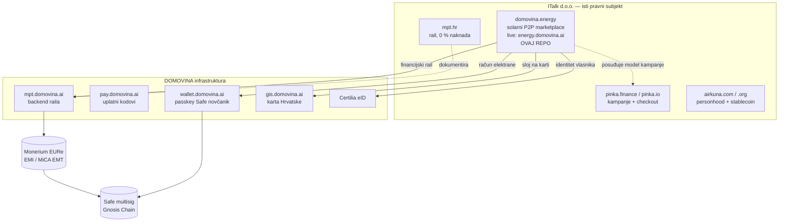

# 00 — Indeks baze znanja

**domovina.energy** je **P2P platforma za zajedničko financiranje i suvlasništvo
sunčanih elektrana u Hrvatskoj**. Živi na **energy.domovina.ai** (closed beta,
jedno okruženje — vidi [12](./12-ime-domena-okruzenja.md)). Ovaj `docs/` direktorij je **jedini izvor istine**
iz kojeg se gradi landing i aplikacija. Kod se piše iz dokumenata, ne obrnuto.

Datum osnivanja baze: **15. rujna 2026.**
Prvi javni rok: **Green Energy Fair 2026, Arena Zagreb, 28.–29.10.2026.** ([11-plan-izvedbe.md](./11-plan-izvedbe.md))

---

## Mapa dokumenata

| # | Dokument | Što sadrži | Mijenja se kad |
|---|---|---|---|
| 01 | [vizija-i-pozicioniranje](./01-vizija-i-pozicioniranje.md) | Što gradimo, za koga, zašto sada, jednorečenično pozicioniranje | odluka o modelu |
| 02 | [trziste-hrvatska](./02-trziste-hrvatska.md) | Brojke o HR solarnom tržištu i energetskim zajednicama, s izvorima i datumima | nova mjerenja/izvori |
| 03 | [pravni-okvir](./03-pravni-okvir.md) | **Najvažniji dokument.** Četiri moguća modela i što svaki traži od HANFA-e/HERA-e | promjena propisa ili modela |
| 04 | [financijska-arhitektura](./04-financijska-arhitektura.md) | Safe multisig, EURe, MPT rail, zašto 0 % naknada, tok novca | promjena raila |
| 05 | [podatkovni-model](./05-podatkovni-model.md) | Entiteti, polja, stanja; ugovor za mock i za kasniji backend | nova polja u UI-ju |
| 06 | [produkt-landing](./06-produkt-landing.md) | Specifikacija landinga — sekcije, copy-okvir, CTA | redizajn landinga |
| 07 | [produkt-app](./07-produkt-app.md) | Specifikacija marketplace aplikacije — ekrani, tijekovi | novi ekran |
| 08 | [karta-i-geo](./08-karta-i-geo.md) | Sloj elektrana na gis.domovina.ai + karta u appu | promjena geo sloja |
| 09 | [dizajn-sustav](./09-dizajn-sustav.md) | Boje, tipografija, komponente; odnos prema pinka/airKUNA brandu | redizajn |
| 10 | [reuse-mapa](./10-reuse-mapa.md) | Točno što se kopira iz kojeg repoa i pod kojim uvjetima | novi izvorni repo |
| 11 | [plan-izvedbe](./11-plan-izvedbe.md) | Faze do GEF-a i nakon; što je blokirano na eksterno | svaki sprint |
| 12 | [ime-domena-okruzenja](./12-ime-domena-okruzenja.md) | **Ime `domovina.energy`, live na `energy.domovina.ai`, jedno okruženje** | promjena domene ili razdvajanje okruženja |
| 13 | [konkurencija](./13-konkurencija.md) | **Pet klasa konkurencije**, dvije ugašene platforme i njihove pouke, K1–K8 izmjene | novi igrač ili nalaz |
| 14 | [poslovni-model](./14-poslovni-model.md) | **Dva moda rada, zašto nismo ECSP, prihod od izvedbe, sukob interesa** | promjena uloge ili prihoda |

### Dnevnici

| Dokument | Što sadrži |
|---|---|
| [2026-09-15-istrazivacki-dnevnik](./2026-09-15-istrazivacki-dnevnik.md) | **Dug provjere** (V1–V8 — tvrdnje koje NISU potvrđene), slijepe ulice, odbačene alternative, lanac zaključivanja koji je lako izgubiti |

---

## Pravila koja održavaju bazu poštenom

Preuzeta iz `pinka-finance/landing/docs/EKOSUSTAV.md` §4 i `airkuna/tokenizacija/CLAUDE.md`,
jer se ista greška već dogodila u obitelji proizvoda.

1. **Jedan broj = jedno mjesto istine.** Svaka tržišna brojka živi u
   [02-trziste-hrvatska.md](./02-trziste-hrvatska.md) s izvorom i datumom provjere.
   Svaka stopa naknade dolazi iz `pinka-finance/landing/lib/fees.ts`. Nikad ne
   piši broj izravno u copy ni u komponentu — uvijek preko konstante koja citira
   ovaj dokument.
2. **Jedan propis = jedan citat s NN brojem.** Bez prepisivanja iz sjećanja ni s
   blogova. Sekundarni izvori (portali, novinski članci) smiju **potvrditi**
   tvrdnju, nikad je sami utemeljiti.
3. **Datum provjere uz svaku tvrdnju.** Materija je u pokretu: ECSPR, MiCA,
   Fiskalizacija 2.0 (1.1.2026.), izmjene Zakona o tržištu električne energije.
   Tvrdnja bez datuma smatra se neprovjerenom.
4. **Regulatorni framing je jedinstven** na svim stranicama obitelji: ITalk d.o.o.
   je **non-custodial pružatelj softvera**; regulirane funkcije obavlja Monerium
   (EMI / MiCA EMT); ništa nije investicijski ni pravni savjet. Vidi
   [03-pravni-okvir.md](./03-pravni-okvir.md) §7.
5. **Prototip se na svakom ekranu deklarira kao prototip** dok ne postoji pravno
   mišljenje i odluka o modelu. Ista konvencija kao `airkuna/tokenizacija`.
6. **Roadmap ne nosi datume koji su prošli.** Prošao kvartal ide u „Isporučeno"
   ili se prepisuje — ne pomiče se tiho.
7. **Ne izmišljaj elektrane.** Kad se u prototip unesu stvarne elektrane, uz svaku
   ide izvor. Do tada su podaci označeni kao `demo: true` i to se vidi u UI-ju.

---

## Odnos prema ostatku obitelji proizvoda

**Prethodnik:** `pinka-finance/energy` (`domovina.energy`) — Faza 1 registra bila je
napisana pa stavljena **on hold**. Taj kod i njegov `DB-MIGRATION.sql` nisu bačeni;
vidi [10-reuse-mapa.md](./10-reuse-mapa.md) §2. Ovaj repo je **izolirani nasljednik**
s širim opsegom (marketplace suvlasništva, ne samo registar).

---

## Kako koristiti bazu u radu

- Prije bilo kakvog koda: pročitaj [01](./01-vizija-i-pozicioniranje.md),
  [03](./03-pravni-okvir.md) i dokument relevantan za task.
- Prije nego napišeš brojku u UI: provjeri postoji li u
  [02](./02-trziste-hrvatska.md). Ako ne postoji — istraži, dodaj s izvorom, pa
  koristi.
- Prije nego obećaš prinos, udio ili povrat u copyju: [03](./03-pravni-okvir.md) §3.
  Ta granica nije stilska, nego licencna.
