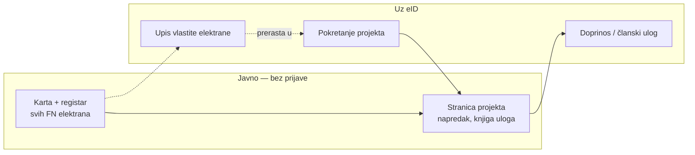

# 01 — Vizija i pozicioniranje

Zadnja revizija: **15.9.2026.**

---

## 1. Jedna rečenica

> **Mjesto gdje ljudi zajedno financiraju i posjeduju sunčane elektrane u Hrvatskoj —
> bez provizije, bez posrednika koji drži novac, i s javnim dokazom tko je što uložio.**

### 1.1 Odluka o pozicioniranju — potvrđeno 15.9.2026.

**Nosiva priča su energetske zajednice, ne „crowdfunding za solar".**

Hero:

> Zakon to dopušta od 2021.
> U Hrvatskoj postoje **tri** takve zajednice.
> Radimo četvrtu — lakšom od prve tri.

Razlozi, redom po težini:

1. **Pravno najčišće.** Član zajednice dobiva energiju i glas, ne novac — to ga
   drži izvan ECSPR-a ([03](./03-pravni-okvir.md) §5.2). Riječ „crowdfunding" u
   heroju odmah poziva pitanje o prinosu i licenci, i to pred publikom koja zna.
2. **Nitko to ne radi.** Solarnih ponuđača je mnogo; zajednica su tri
   ([02](./02-trziste-hrvatska.md) §3). Razlika nije u tehnologiji nego u modelu
   vlasništva.
3. **Brojka „tri" radi posao umjesto nas.** Ne treba objašnjavati da problem
   postoji.
4. **Solar je sredstvo, ne tema.** Tema je tko smije posjedovati proizvodnju.

**Posljedica za copy:** riječ „crowdfunding" se **ne koristi** u heroju ni u
navigaciji. Smije se pojaviti niže, kao pojašnjenje mehanike („zajedničko
financiranje"), nikad kao obećanje modela.

---

## 2. Problem koji rješavamo

Ne „ljudi ne znaju za solar". 44.000 elektrana kaže da znaju
([02](./02-trziste-hrvatska.md) §1).

Problem je u tri koraka:

1. **Solar je pojedinačan sport.** Tko ima krov, kapital i strpljenje — ima
   elektranu. Tko živi u stanu, nema 12.000 €, ili ima krov koji ne gleda na jug —
   isključen je. To je struktura, ne informiranost.
2. **Zajedničko vlasništvo je zakonski moguće, a praktički nepostojeće.**
   Registracija zajednice: preko **20.000 €** i **više od šest mjeseci**. Rezultat:
   **tri** zajednice u cijeloj zemlji, **nijedna** ZOE pet godina nakon zakona
   ([02](./02-trziste-hrvatska.md) §3).
3. **Za udruživanje kapitala danas moraš vjerovati posredniku.** Banka, platforma
   ili fond drži novac, uzima proviziju i traži povjerenje koje se ne može
   provjeriti. Kod male zajednice od 20 susjeda taj je trošak povjerenja veći od
   iznosa.

**Naš zahvat je na trećem koraku, i djelomično na drugom.** Prvi je posljedica.

---

## 3. Za koga

| Segment | Što ga boli | Što mu nudimo | Prioritet |
|---|---|---|---|
| **Zajednica u nastajanju** (zgrada, susjedstvo, udruga, mjesni odbor) | 20 ljudi želi elektranu, nitko ne želi držati zajednički novac | Safe multisig M-od-N, javna knjiga uloga, predložak koraka | **1 — nosivi** |
| **Nositelj projekta** (zadruga, udruga, JLS, škola) | ima projekt i legitimitet, nema alat za prikupljanje ni za transparentnost | stranica projekta, uplatni kodovi, javno izvješćivanje iz on-chain podataka | **1 — nosivi** |
| **Doprinositelj / član** | želi sudjelovati u energetskoj tranziciji s 200 €, a ne 12.000 € | ulaz od malog iznosa, dokaz doprinosa, vidljivost gdje je novac | **1** |
| **Vlasnik postojeće elektrane** | njegova elektrana nije nigdje vidljiva, nema referentnu točku | besplatan upis u javni registar + karta | **2 — akvizicijski kanal** |
| **Instalater / EPC** | leadovi, dokaz izvedenih projekata | profil izvođača vezan uz projekte | **3 — kasnije** |
| **JLS / županija** | ima krovove i političku volju, nema mehanizam sudjelovanja građana | model „građani suinvestiraju u krov javne zgrade" | **2** |

---

## 3.1 Nismo samo platforma — **gradimo**

Odluka 15.9.2026. ([14](./14-poslovni-model.md)): u nosivom modu smo **izvođač koji
prodaje elektranu ključ u ruke**, a ne posrednik tuđih ulaganja. Novac koji ljudi
uplate nije ulog nego **predujam na elektranu koju od nas naručuju**.

To mijenja tri stvari:

1. **Prihod postoji** — marža na izvedbi, ne postotak od prikupljenog.
2. **ECSP nije potreban** — nema trećeg nositelja kojeg bismo spajali s ulagateljima.
3. **Odgovorni smo za isporuku.** Kašnjenje više nije tuđa greška koju prenosimo
   dalje nego naše neispunjenje ugovora.

Tko ne želi nas kao izvođača, u nekoliko klikova prebacuje projekt na **vlastiti
Monerium IBAN i vlastiti Safe** — i tada novac ne prolazi kroz nas uopće. To nije
ustupak nego dokaz da tvrdnja „ne držimo vaš novac" nije marketinška.

---

## 4. Dva proizvoda u jednom

### 4.1 Registar (javan, bez prijave)

Karta i popis **svih** sunčanih elektrana u Hrvatskoj — postojećih, u izgradnji,
planiranih. Elektrana **može postojati u registru bez ikakve kampanje.**

Zašto registar prvi:
- To je jedini dio koji **odmah ima vrijednost bez ijednog korisnika** — karta s
  1.500 MW je zanimljiva sama po sebi.
- Rješava hladan start marketplacea: kad prvi projekt krene, kontekst već postoji.
- Prirodan razlog dolaska na stranicu izvan trenutka ulaganja.
- Sloj na `gis.domovina.ai` već ima obrazac za to ([08](./08-karta-i-geo.md)).

### 4.2 Marketplace (prijava + eID)

Projekti koji traže suradnju: zajednica koja gradi, škola koja financira krov,
zadruga koja širi kapacitet. Svaki projekt ima **vlastiti Safe**, javnu knjigu
doprinosa i jasan model ([03](./03-pravni-okvir.md) §2).

---

## 5. Čime se razlikujemo

| | Klasična crowdfunding platforma | Banka / kredit | **domovina.energy** |
|---|---|---|---|
| Tko drži novac | platforma | banka | **nitko osim samih članova** (Safe M-od-N) |
| Provizija | 5–8 % | kamata | **0 %** ([04](./04-financijska-arhitektura.md)) |
| Tko vidi stanje | platforma, djelomično korisnik | banka i vlasnik računa | **svi, uvijek, on-chain** |
| Što korisnik dobiva | proizvod ili ništa | dug | **energiju i članska prava** (model B) |
| Izlaz ako platforma nestane | novac zaglavljen | — | **Safe i dalje radi bez nas** |

Zadnji redak je najvažniji i najlakše ga je dokazati: Safe je standardni ugovor na
Gnosis Chainu, članovi su vlasnici, platforma je samo sučelje. To je ista tvrdnja
koju mpt.hr već dokumentira za rail.

**I nije više samo argument iz principa.** UK platforma **Ripple Energy** otišla je
2025. u stečajnu upravu, a njezine vjetro i solarne zadruge — Graig Fatha s 900+
članova, Kirk Hill s 5.603 člana — **nastavile su raditi**, jer imovina nikad nije
bila Rippleova nego zadružna ([13](./13-konkurencija.md) §4.1). To je dokaz na
stvarnom slučaju i treba ga citirati poimence.

---

## 6. Zašto baš sada

1. **Solar je prestigao vjetar** po instaliranoj snazi u RH (početak 2026.) —
   tema je u glavnom toku, ne više niša.
2. **Prva zajednica koja stvarno dijeli struju proradila je 1.6.2026.** (Špičkovina).
   Postoji domaći presedan na koji se može pokazati.
3. **Europski revizorski sud objavio je izvješće 10/2026** o preprekama energetskim
   zajednicama — tema je na europskoj agendi, s pritiskom na države.
4. **GEF 2026, 28.–29.10., Arena Zagreb**, 120+ izlagača, program eksplicitno
   pokriva sustainable finance i ESG. Prirodna prva publika.
5. **Rail je gotov.** MPT, Safe, EURe, Certilia, wallet i karta već rade u produkciji
   za druge vertikale ([10](./10-reuse-mapa.md)). Ne gradimo infrastrukturu — spajamo
   je na nov use-case.
6. **Potražnja je dokazana, alat nije.** ZEZ Sunce prikupio je **140.000 € u desetak
   dana** od 127 članova — kroz **Google obrazac**
   ([13](./13-konkurencija.md) §2). Ne treba nam hipoteza da ljudi žele sudjelovati;
   treba nam alat koji to čini podnošljivim.

---

## 7. Što NE gradimo (barem ne sada)

Eksplicitno, da se ne rasipa opseg:

- ❌ **Nismo ECSP platforma.** Ni zajmovi ni vlasnički udjeli s prinosom
  ([03](./03-pravni-okvir.md) §3). Bez HANFA odobrenja to je zabranjeno, ne
  neugodno.
- ❌ **Ne osnivamo zajednice umjesto ljudi.** Dajemo predložak i popis koraka.
  Obećati više bilo bi netočno.
- ❌ **Ne obračunavamo raspodjelu energije.** To radi opskrbljivač/ODS. Mi
  prikazujemo, ne mjerimo.
- ❌ **Ne držimo sredstva ni ključeve.** Trenutak kad bismo ih držali je trenutak
  kad trebamo CASP/PSD2 licencu.
- ❌ **Ne prodajemo opremu ni izvedbu.** Instalateri su partneri, ne konkurencija.
- ❌ **Ne radimo sekundarno tržište udjela.** To je model D
  ([03](./03-pravni-okvir.md) §6.2), audit-gated i licencno gated.

---

## 8. Kako znamo da je uspjelo

Za prvu godinu, redom po težini:

1. **Registar**: 500+ elektrana na karti (miješano iz javnih izvora i samoupisa).
2. **Prvi projekt** s pravim novcem na pravom Safeu, ma koliko malen.
3. **Jedna zajednica** koja je prošla put od ideje do registracije koristeći naš
   predložak — i to javno kaže.
4. **Nula** slučajeva u kojima je netko na platformi obećao prinos.
5. Pisano pravno mišljenje na pitanja iz [03](./03-pravni-okvir.md) §9 — bez toga
   se ne skalira ni s najboljim proizvodom.
