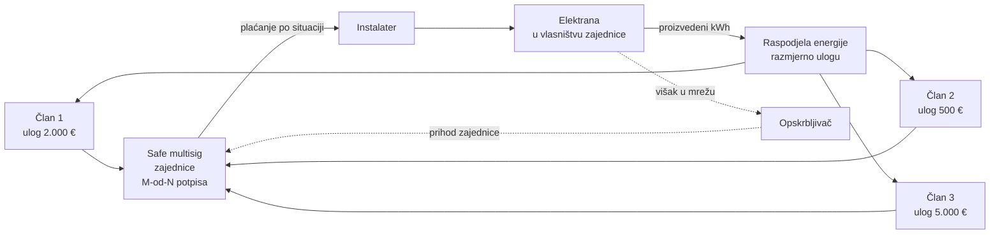

# 03 — Pravni okvir: četiri modela i gdje je granica

> ⚠️ **Nije pravni ni porezni savjet.** Ovo je činjenična podloga za produktne
> odluke. Prije nego platforma omogući bilo koji model označen ⚠️ ili ❌,
> obavezna je konzultacija s odvjetnikom i poreznim savjetnikom, a za modele
> C i D upit HANFA-i.

Naslijeđuje i proširuje `pinka-finance/landing/docs/pravni-okvir-primanja-sredstava.md`
(donacije/humanitarne akcije) i `airkuna/tokenizacija/docs/plan/02-realt-model-i-regulativa.md`
(tokenizirani vrijednosni papiri). **Oba i dalje vrijede** — ovaj dokument dodaje
energetski sloj koji tamo ne postoji.

Zadnja revizija: **15.9.2026.**

---

## 1. Zašto je solar pravno teži od nogometnog kluba

Pinka je do sada radila s primateljima kojima donacija **nije prihod** (udruga za
statutarnu djelatnost) ili je jasno oporeziva (d.o.o.). Sunčana elektrana je
drukčija po tri stvari:

1. **Proizvodi mjerljiv novčani tok.** Struja se ili troši (ušteda) ili prodaje
   (prihod). Čim uplatitelj očekuje udio u tome, više nije donator nego ulagatelj.
2. **Obavlja energetsku djelatnost.** Proizvodnja i opskrba električnom energijom
   su regulirane djelatnosti pod nadzorom **HERA-e**, uz dozvole i registar.
3. **Ima fizičku imovinu s vlasništvom.** Elektrana stoji na nečijem krovu ili
   zemljištu. Suvlasništvo nad elektranom i vlasništvo nad nekretninom moraju biti
   usklađeni — to je točno mjesto na kojem je RealT tužen u Detroitu 2025.
   (`tokenizacija/docs/plan/02` §2.5).

Zaključak: **model se bira prije dizajna, ne poslije.** Copy, ekrani i podatkovni
model razlikuju se po modelu, a ne samo po tonu.

---

## 2. Četiri modela — usporedna tablica

| | **A · Donacijski** | **B · Energetska zajednica** | **C · ECSP (zajam/udio)** | **D · Tokenizirani udio** |
|---|---|---|---|---|
| Što uplatitelj dobiva | ništa (ili simbolično priznanje) | **članstvo + udio u proizvedenoj energiji** | kamatu ili vlasnički udio | prenosivi token s tržišnom cijenom |
| Nositelj | udruga, JLS, škola, zadruga | ZOE / EZG / energetska zadruga | d.o.o. / d.d. / SPV | SPV po elektrani |
| Regulator | Ministarstvo (ZHP, ako je humanitarno) | **HERA** (energetika), Ministarstvo (neprofitno) | **HANFA** (ECSPR) | **HANFA** (prospekt / ZTK / DLT Pilot) |
| Licenca platforme | ❌ ne treba | ❌ ne treba | ✅ **ECSP odobrenje** | ✅ prospekt + vjerojatno DLT MTF |
| Rok odobrenja | — | — | **3 mjeseca** od urednog zahtjeva | 6–18 mj., realno duže |
| Gornja granica | nema (ali porezno vidi §4) | nema formalne | **5 M€ / projekt / god.** | do 8 M€ bez punog prospekta (HR prag) |
| Može li ITalk ovo danas | **✅ da** | **✅ da** | ❌ ne | ❌ ne |
| Prototip za GEF | ✅ | ✅ | prikaz kao „Faza N" | prikaz kao „Faza N" |

---

## 3. Granica koju ne smijemo prijeći — i gdje točno leži

**Uredba (EU) 2020/1503 (ECSPR)** + hrvatski provedbeni
[Zakon, NN 144/21](https://narodne-novine.nn.hr/clanci/sluzbeni/2021_12_144_2458.html).
Nadzor: [HANFA — skupno financiranje](https://www.hanfa.hr/podrucja-nadzora/trziste-kapitala/skupno-financiranje-crowdfunding/).

**Uredba se primjenjuje** na skupno financiranje temeljeno na **zajmovima** i na
**vlasničkim udjelima / prenosivim vrijednosnim papirima**.

**Uredba se NE primjenjuje** na:
- **donacijski** model,
- **nagradni** model,
- slučajeve u kojima su **nositelji projekta potrošači** (fizičke osobe).

Prevedeno u rečenice koje smiju odnosno ne smiju stajati u našem sučelju:

| Formulacija u UI-ju | Status |
|---|---|
| „Financiraj izgradnju elektrane svoje škole." | ✅ model A |
| „Postani član zajednice i koristi struju koju zajedno proizvodimo." | ✅ model B |
| „Tvoj doprinos je javno i trajno zabilježen on-chain." | ✅ — potvrda doprinosa, ne vrijednosni papir |
| „Očekivani prinos 7 % godišnje." | ❌ **model C** — ECSP |
| „Primaj mjesečnu isplatu od prodane struje." | ❌ **model C** |
| „Prodaj svoj udio drugom korisniku." | ❌ **model D** — prenosivost + tržišna cijena |
| „Vrijednost tvog udjela raste s cijenom struje." | ❌ **model D** |

> **Test u jednoj rečenici:** čim ono što korisnik drži nosi **očekivanje prinosa,
> udio u dobiti ili prenosivost s tržišnom cijenom**, analiza se seli na prenosivi
> vrijednosni papir (ZTK / prospekt / ECSP) ili kriptoimovinu (MiCA, bijela knjiga,
> CASP). Ista granica kao „soft tokenizacija" na pinki
> (`landing/docs/pravni-okvir-primanja-sredstava.md` §6.1).

**MiCA ne pomaže.** MiCA izričito **isključuje financijske instrumente** — „MiCA
licenca" nije zaobilaznica za udio u elektrani
(`tokenizacija/docs/plan/02` §2.6).

---

## 4. Model A — donacijski / zajednički doprinos

Najkraći put do nečega živog. Nasljeđuje cijeli pinkin okvir; ovdje samo razlike.

**Tko smije primati** — puna matrica u
`pinka-finance/landing/docs/pravni-okvir-primanja-sredstava.md` §1. Za solar
relevantno:

| Primatelj | Svrha | Smije li | Napomena |
|---|---|---|---|
| Udruga / zadruga / zaklada | elektrana za vlastitu djelatnost (krov doma, škole, vatrogasnog doma) | ✅ | statut mora pokrivati svrhu; **nije** humanitarna akcija pa **ne treba** rješenje po ZHP-u |
| JLS / škola / javna ustanova | elektrana na javnoj zgradi | ✅ | proračunska pravila, ne ZHP |
| Fizička osoba | elektrana na vlastitom krovu | ⚠️ | donacija fizičkoj osobi za privatnu imovinu **nema** poreznu zaštitu iz čl. 8. st. 1. t. 5. Zakona o porezu na dohodak — to nije općekorisna svrha |
| d.o.o. / obrt | elektrana za vlastiti pogon | ⚠️ | donacija d.o.o.-u je **prihod** → porez na dobit |

**Ključna zamka koju solar nosi, a nogomet nije:** elektrana na privatnom krovu
podiže vrijednost privatne imovine. „Donacija" tamo vrlo brzo postaje ili
oporezivi primitak ili prikriveni ulog. **Model A je čist kad je korisnik
kolektivan** (zgrada, udruga, škola, JLS), a mutan kad je pojedinac.

**Zamka viška sredstava:** ako prikupljeno nije utrošeno za navedenu svrhu,
neutrošena sredstva postaju oporeziv primitak
(`pravni-okvir-primanja-sredstava.md` §4.3). Kod elektrane je to vjerojatnije nego
kod dresova — ponuda instalatera se mijenja, priključak se odgodi. Proizvod mora
tražiti **izjavu o namjeni viška** prije prelaska cilja.

---

## 5. Model B — energetska zajednica (preporučeni nosivi model)

Ovo je model koji hrvatski zakon **već dopušta**, a nitko ga ne koristi
([02-trziste-hrvatska.md](./02-trziste-hrvatska.md) §3).

### 5.1 Pravni oblici

Energetske zajednice građana (EZG) i zajednice obnovljive energije (ZOE) su
**pravne osobe neprofitnog karaktera** i mogu se osnovati kao **udruga**; energetske
zadruge kao **zadruga**.

| Propis | Uloga | Poveznica |
|---|---|---|
| Zakon o tržištu električne energije | definira **EZG** kao aktera na tržištu, njegova prava i obveze | zakon.hr |
| Zakon o obnovljivim izvorima energije i visokoučinkovitoj kogeneraciji | okvir za **ZOE**, poticanje proizvodnje i potrošnje iz OIE | zakon.hr |
| Zakon o udrugama (NN 74/14, 70/17, 98/19, 151/22) | oblik za EZG/ZOE kao neprofitnu pravnu osobu | [zakon.hr/z/64](https://www.zakon.hr/z/64/zakon-o-udrugama) |
| Zakon o zadrugama (NN 34/11, 125/13, …) | oblik za **energetsku zadrugu** | zakon.hr |
| Zakon o financijskom poslovanju i računovodstvu neprofitnih organizacija | računovodstveni režim EZG/ZOE | [zakon.hr/z/746](https://www.zakon.hr/z/746/zakon-o-financijskom-poslovanju-i-racunovodstvu-neprofitnih-organizacija) |
| Pravilnik o dozvolama za obavljanje energetskih djelatnosti | dozvole + registar (HERA) | NN |
| Pravilnik o općim uvjetima za korištenje mreže i opskrbu el. energijom | priključak, mrežna pravila | NN |
| Odluka o visini naknada za regulaciju energetskih djelatnosti (NN 38/22) | naknade HERA-i | [NN 38/22](https://narodne-novine.nn.hr/clanci/sluzbeni/2022_03_38_452.html) |

Izvor popisa: energetske-zajednice.hr/legislation/hrvatsko-zakonodavstvo, provjereno 15.9.2026.

### 5.2 Zašto je model B pravno elegantan za nas

Član zajednice ne dobiva **novac**, nego **energiju i članska prava**. To ga vadi
iz ECSPR-a jer nema ni zajma ni vlasničkog udjela s prinosom — ima
**udio u proizvedenoj kilovatsatnoj energiji** i glas u zajednici.

**Kritična razlika koju treba držati čistom:** strelica `OPS -.prihod.-> S` vodi u
**blagajnu zajednice**, ne u džep pojedinog člana. Čim bi se taj novac dijelio
članovima razmjerno ulogu, model klizne u C.

### 5.3 Što softver stvarno rješava, a što ne

| Prepreka | Rješava li je platforma |
|---|---|
| 20.000 € i 6 mjeseci za osnivanje | ❌ **ne** — pravna, ne tehnička. Platforma nudi **predložak statuta, popis koraka i procjenu troška**, ne osnivanje |
| Udruživanje kapitala bez posrednika | ✅ **da** — Safe multisig, [04](./04-financijska-arhitektura.md) |
| Dokaz tko je koliko uložio | ✅ **da** — on-chain, javno i vremenski označeno |
| Kontrola tko smije potrošiti novac | ✅ **da** — M-od-N multisig, bez skrbništva platforme |
| Obračun raspodjele energije | ⚠️ **djelomično** — obračun je na opskrbljivaču/ODS-u; mi prikazujemo, ne obračunavamo |
| Priključak na mrežu | ❌ ne |

> Ovo razlikovanje mora biti **eksplicitno na landingu**. Obećati „osnujemo vam
> zajednicu" bilo bi netočno i lako oboriti pred publikom na GEF-u koja to zna.

---

## 6. Modeli C i D — što bi trebalo i zašto ih danas ne radimo

### 6.1 C — zajam ili vlasnički udio (ECSP)

Traži **odobrenje HANFA-e** kao pružatelj usluga skupnog financiranja. HANFA
odlučuje u roku **3 mjeseca** od urednog zahtjeva (čl. 12. st. 8. ECSPR-a).
Granica je **5 M€ po projektu u 12 mjeseci**.

Uz odobrenje dolazi paket obveza koji nije kozmetički: informacijski dokument o
ključnim ulaganjima (KIIS), test znanja i simulacija sposobnosti podnošenja
gubitka za neiskusne ulagatelje, razdoblje razmišljanja, pravila o sukobu interesa,
kapitalni zahtjevi, izvještavanje.

**Za solar je to prirodan model** — elektrana je predvidiv novčani tok i tipičan
ECSP projekt u EU (Njemačka, Nizozemska, Estonija to rade). Ali je to **odluka o
poslovnom modelu i licenci**, ne sprint.

### 6.2 D — tokenizirani udio

Token s pravom na prihod je gotovo sigurno **prenosivi vrijednosni papir po
MiFID II**. Put: **SPV po elektrani** (d.d. radi prenosivosti dionica; udjeli
d.o.o.-a traže javnobilježničku formu) → prospekt koji odobrava HANFA (ispod HR
praga 8 M€ pojednostavljeno) → sekundarno trgovanje pod **DLT Pilot Regime
(EU 2022/858)** uz odobrenje HANFA-e i ESMA-e.

Puna analiza: `airkuna/tokenizacija/docs/plan/02-realt-model-i-regulativa.md`.
Ugovori: `pinka-finance/pinka-finance-mvp` — **neauditirani**, s otvorenim
kritičnim nalazima (V-1 SEPA refund insolvency, V-2 double-mint, V-3 unbacked
mint, vidi `pinka-finance/app/docs/SECURITY-FINDINGS.md`). **Audit-gated.**

**Pouka iz RealT-a** koja se mora ugraditi od prvog dana: 2025. tužen je u
Detroitu jer je prodavao tokene za nekretnine čiji **prijenos vlasništva nije bio
dovršen**. Kod nas ekvivalent: **ne smije postojati udio u elektrani prije nego što
elektrana postoji i prije nego je vlasništvo/pravo građenja uredno upisano.**

---

## 7. Pozicioniranje platforme — formulacija koja se ne mijenja

Doslovno preuzeto iz obitelji proizvoda (mpt.hr → pinka.finance), jer je
konzistentnost ovdje pravno relevantna:

> **ITalk d.o.o. je non-custodial pružatelj softvera.** Sredstva nikad ne prolaze
> kroz platformu niti platforma drži ključeve. Regulirane funkcije e-novca obavlja
> **Monerium** (EMI, MiCA EMT). Platforma nije pružatelj usluga skupnog financiranja
> po Uredbi (EU) 2020/1503, nije investicijsko društvo i ne daje investicijski
> savjet. Organizator kampanje odgovoran je za pravni oblik, dozvole i porezni
> tretman.

**Impresum** (doslovno, ne po sjećanju): ITalk d.o.o. za informacijske tehnologije,
IX. Južna obala 20, 10000 Zagreb · OIB 54872935051 · MBS 081042440 ·
EUID HRSR.081042440 · Trgovački sud u Zagrebu · direktor: Matija Stepanić.

---

## 8. Proizvodni zahtjevi koji izlaze iz ovog dokumenta

Numeracija `E1…` da se može referencirati iz issueva. Zrcali `P1…P7` iz pinkinog
pravnog dokumenta, ali za energetiku.

| # | Zahtjev | Zašto |
|---|---|---|
| **E1** | **Tip nositelja** je prvo pitanje pri kreiranju projekta (zajednica / udruga / JLS / tvrtka / pojedinac) i mijenja cijeli daljnji tijek | §2, §4 |
| **E2** | **Model financiranja** eksplicitno odabran i vidljiv na kartici projekta (doprinos / članski ulog u zajednici). C i D su u UI-ju **onemogućeni** s objašnjenjem | §3 |
| **E3** | **Blokada copyja** koji obećava prinos, isplatu ili prenosivost — validacija na opisu projekta, ne samo smjernica | §3 |
| **E4** | Status **„čeka priključak"** kao prvorazredno stanje, s datumom zahtjeva | [02](./02-trziste-hrvatska.md) §4 |
| **E5** | **Izjava o namjeni viška** kad projekt prijeđe cilj | §4 |
| **E6** | **Dokaz prava na lokaciju** (vlasništvo / suglasnost suvlasnika / pravo građenja) kao uvjet za objavu projekta | §6.2, RealT pouka |
| **E7** | **eID verifikacija nositelja** (Certilia) prije objave — server-computed, nikad iz klijentskog patcha | naslijeđeno iz `solar.ts` / `DB-MIGRATION.sql` |
| **E8** | Uvjeti korištenja koji jasno kažu da je **nositelj odgovoran** za dozvole i porezni tretman, a platforma je tehnički pružatelj | §7 |
| **E9** | Kod modela B: **vidljiv disclaimer da platforma ne osniva zajednicu** i procjena stvarnog troška/trajanja | §5.3 |

---

## 9. Otvorena pitanja — za odvjetnika i za HANFA-u/HERA-u

1. **Je li „članski ulog u energetsku zadrugu prikupljen preko platforme" izvan
   ECSPR-a?** Naša pretpostavka je da jest (nije ni zajam ni prenosivi vrijednosni
   papir), ali to traži pisano mišljenje — o tome ovisi cijeli model B.
2. Smije li zajednica članovima **raspodjeljivati novčani višak** od prodane struje
   a da to ne postane udio u dobiti? Zadružno pravo poznaje raspodjelu — kako se
   odnosi prema ECSPR-u?
3. Vrijedi li **Safe adresa kao „namjenski račun"** u smislu propisa koji traže
   zaseban račun? (Isto neriješeno pitanje kao kod pinke,
   `pravni-okvir-primanja-sredstava.md` §9.2.)
4. Kako se **EURe tretira u trenutku primitka** kod neprofitne pravne osobe — je li
   primitak nastao dolaskom EURe ili konverzijom u eure na žiroračunu?
5. Treba li platforma **ikakvu registraciju kod HERA-e** ako samo prikazuje
   registar i ne obavlja energetsku djelatnost?
6. Može li **JLS** biti nositelj projekta financiranog doprinosima građana bez
   posebnog proračunskog postupka?
7. Pod kojim uvjetima smijemo **objaviti registar postojećih elektrana** iz javnih
   izvora (HROTE/HERA/HEP-ODS/**OIEKPP**) — licenca podataka i GDPR za elektrane
   fizičkih osoba.
8. **NAJHITNIJE — samoizdavanje vs posredovanje.** ZEZ Sunce javno nudi članovima
   „prinos do 5 % godišnje" kao zadruga koja prikuplja **za sebe**. Gdje je granica
   na kojoj platforma prestaje biti tehnički alat te zadruge i postaje **pružatelj
   usluga skupnog financiranja** po ECSPR-u — broj nositelja, naplata, tko oglašava,
   tko sklapa ugovor s članom? O tome ovisi smijemo li uopće prikazati tuđu brojku
   od 5 % na stranici njihovog projekta. Razrada: [13](./13-konkurencija.md) §2.1, §8.

---

## Izvori

**Propisi**
- [Uredba (EU) 2020/1503 — ECSPR](https://eur-lex.europa.eu/legal-content/HR/TXT/?uri=CELEX%3A32020R1503) · [Zakon o provedbi, NN 144/21](https://narodne-novine.nn.hr/clanci/sluzbeni/2021_12_144_2458.html)
- Zakon o tržištu električne energije · Zakon o obnovljivim izvorima energije i visokoučinkovitoj kogeneraciji
- [Zakon o udrugama](https://www.zakon.hr/z/64/zakon-o-udrugama) · Zakon o zadrugama · [Zakon o financijskom poslovanju i računovodstvu neprofitnih organizacija](https://www.zakon.hr/z/746/zakon-o-financijskom-poslovanju-i-racunovodstvu-neprofitnih-organizacija)
- [Zakon o porezu na dohodak](https://www.zakon.hr/z/85/zakon-o-porezu-na-dohodak) · [Zakon o porezu na dobit](https://www.zakon.hr/z/99/zakon-o-porezu-na-dobit)
- Prospektna uredba (EU) 2017/1129 · DLT Pilot Regime (EU) 2022/858 · MiCA (EU) 2023/1114

**Tijela**
- [HANFA — skupno financiranje](https://www.hanfa.hr/podrucja-nadzora/trziste-kapitala/skupno-financiranje-crowdfunding/) · HERA · Europski revizorski sud, Tematsko izvješće 10/2026

**Interno (obitelj proizvoda)**
- `pinka-finance/landing/docs/pravni-okvir-primanja-sredstava.md` — donacije, ZHP, porez, ECSP matrica
- `pinka-finance/app/docs/2026-08-08-pravni-gate.md` — kako su P1–P3 implementirani
- `airkuna/tokenizacija/docs/plan/02-realt-model-i-regulativa.md` — RealT i tokenizirani papiri
- `airkuna/airkuna-web/research/licence-hanfa-hnb.md` — MiCA/PSD2/CASP/PI analiza
- `pinka-finance/app/docs/SECURITY-FINDINGS.md` — otvoreni nalazi na MVP ugovorima
