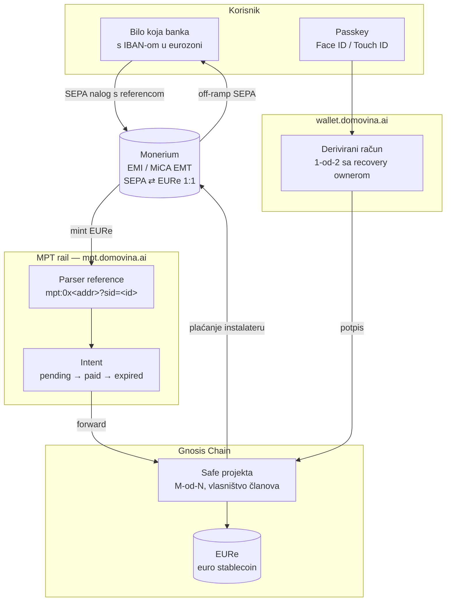

# 04 — Financijska arhitektura: Safe multisig, EURe, 0 % naknada

Zadnja revizija: **15.9.2026.**

> **Izvor istine za mehanizam je kod, ne ovaj dokument.** Kanonski repoi:
> `domovinatv/pay.domovina.ai` (rail, Monerium ugovor, Gnosis Pay),
> `domovinatv/mpt-landing/src/lib/mpt-machine.ts` (state machine toka novca),
> `pinka-finance/app/lib/chain/` (Safe derivacija, passkey, wallet SDK).
> Nikad ne modeliraj tok novca iz sjećanja — ista greška već je napravljena i
> dokumentirana u `mpt-landing/CLAUDE.md`.

---

## 1. Zašto uopće blockchain za solarnu zadrugu

Ne zbog „kriptovaluta". Zbog tri konkretna svojstva koja klasični žiroračun nema,
a zajednica od 20 susjeda ih treba:

| Potreba zajednice | Klasičan žiroračun | Safe multisig |
|---|---|---|
| Novac ne smije ovisiti o jednoj osobi | jedan ili dva potpisnika, banka odlučuje o pravilima | **M-od-N** potpisa, pravilo je u ugovoru |
| Svatko mora moći provjeriti stanje | izvod vidi samo ovlaštenik | **javno, stalno, bez dozvole** |
| Dokaz tko je kad koliko uplatio | interna evidencija blagajnika | **on-chain, vremenski označeno, nepromjenjivo** |
| Trošak transakcije | 0,25–0,40 € po nalogu (HR banke) | ~0,01 € na Gnosisu, gas sponzoriran |

Četvrti redak je manje važan od prva tri. **Argument nije cijena — argument je da
nitko ne mora vjerovati blagajniku.**

---

## 2. Slojevi

**Krug je zatvoren:** novac ulazi iz banke i, kad zajednica plaća instalatera,
izlazi natrag u banku. Između je EURe, koji je e-novac izdan od regulirane
institucije (Monerium, EMI / MiCA EMT), ne špekulativna imovina.

---

## 3. Safe po projektu

Naslijeđeno iz `pinka-finance/app/lib/chain/safe.ts` i
`app/docs/wallet-campaign-account-handoff.md`.

### 3.1 Dva obrasca — i koji biramo

| | Legacy (pinka danas) | **Handoff u wallet (odabrano)** |
|---|---|---|
| Vlasništvo | 1-od-1, owner = spojeni WebAuthn potpisnik | **1-od-2**: potpisnik + recovery owner |
| Vidljivost u novčaniku | ❌ nevidljiv, wallet odbija potpisati | ✅ **nativni račun**, u listi računa |
| Oporavak | samo preko `/recover` | ✅ recovery owner |
| Sync među uređajima | ne | ✅ backend registry |
| Derivacija | klijentski, `saltNonce = keccak256("pinka:campaign:{id}")` | wallet vlastitom shemom |

Za energiju je izbor jasan: **Safe se otvara kroz wallet handoff**
(`Domovina.createAccount({ name })`, SDK ≥ 0.10). Razlog nije udobnost nego
[01](./01-vizija-i-pozicioniranje.md) §5 zadnji redak — račun mora biti upotrebljiv
i kad naše sučelje ne postoji. Safe koji je vidljiv samo kroz našu stranicu tu
tvrdnju ne ispunjava.

⚠️ **Status:** pinka strana je isporučena i feature-detectana; **wallet strana
(`createAccount`) još nije isporučena** u `pay.domovina.ai/wallet`. Do tada se
koristi legacy derivacija. Za nas to znači: prototip prikazuje ciljni model,
implementacija ga feature-detecta.

### 3.2 Prag potpisa po modelu

| Model ([03](./03-pravni-okvir.md) §2) | Preporučeni Safe |
|---|---|
| A — doprinos udruzi/JLS-u | 1-od-2 (nositelj + recovery) — nositelj ionako pravno odgovara |
| **B — energetska zajednica** | **M-od-N po članovima upravnog tijela**, npr. 3-od-5 |
| C / D | izvan opsega dok nema licence |

Kod modela B prag potpisa **mora odgovarati statutu zajednice.** Ako statut kaže
da o trošku iznad X odlučuje skupština, a Safe to dopušta s dva potpisa —
softver tiho ruši pravilo koje smo obećali provoditi. To je najozbiljnija
dizajnerska zamka cijelog proizvoda.

### 3.3 Nulta adresa

Iz `lib/chain/constants.ts`: projekt s `destination_address` = nulta adresa
**ne smije biti aktivan ni javno vidljiv** — doprinosi bi bili spaljeni.
Ista invarijanta vrijedi ovdje, s dodatkom da je iznos po projektu vjerojatno veći
nego kod donacije klubu.

---

## 4. Zašto 0 % naknada — i što to točno znači

**Znači:** platforma ne uzima postotak. Nema `platform_fee`, nema skrivenog spreada
na konverziji, nema naknade za isplatu.

**Ne znači** da je svaki korak besplatan za svakoga. Poštena tablica (stope iz
`pinka-finance/landing/lib/fees.ts`, kanonski izvor je analiza isplativosti ZEF-a,
vidi `landing/docs/EKOSUSTAV.md` §4.1):

| Korak | Tko plaća | Koliko |
|---|---|---|
| SEPA nalog iz HR banke | **pošiljatelj, svojoj banci** | 0,25–0,40 € fiksno |
| Monerium mint/redeem EURe | nitko | 0 € |
| Transakcija na Gnosisu | **relayer (mi)** | ~0,01 €, sponzorirano |
| Doprinos projektu | nitko | **0 €** |
| Isplata instalateru (off-ramp) | nitko | 0 € |
| Platforma | — | **0 %** |

> **Pravilo:** nijedna stopa se ne piše u copy izravno. Sve dolazi iz `fees.ts`
> ekvivalenta u ovom repou. Usporedba s klasičnim platformama uvijek je označena
> kao ilustrativna — isti obrazac kao `SavingsCalculator` na mpt.hr.

⚠️ **Poznati nesklad u obitelji:** `mpt-landing/src/lib/market-fees.ts` tvrdi SEPA
raspon 0,25–**0,45** €, dok su kanonski dokument i mpt-ov vlastiti `CLAUDE.md`
oboje 0,25–**0,40** €. Ispravno je **0,40**. Ne prenosi grešku u ovaj repo.

### 4.1 Kako se onda platforma financira

Pošteno pitanje koje će netko postaviti na GEF-u. Odgovori koji ne ruše model:

- **bijela etiketa / konzalting** — isti obrazac kao pinka (MIT kod + plaćena
  implementacija za JLS, zadrugu ili instalatera),
- **dobrovoljna napojnica** (⚠️ otvoreno porezno pitanje, vidi
  `landing/docs/pravni-okvir-primanja-sredstava.md` §9.5),
- **javni/EU natječaji** za energetske zajednice.

Ono što **ne** smije biti odgovor: postotak od prikupljenog. Time pada i tvrdnja i
dio pravnog pozicioniranja.

### 4.2 Egzistencijalno ograničenje koje iz toga slijedi

Dvije referentne platforme za suvlasništvo — **Ripple Energy** i **Sun Exchange** —
ugašene su, a **obje su imale prihodovni model**. Sun Exchange je propao doslovno na
trošku administriranja ~10.000 suvlasnika: prihod projekata pokrivao je vlastite
troškove projekata, ali ne i trošak upravljanja vlasnicima
([13](./13-konkurencija.md) §5.1).

Budući da mi provizije **nemamo po dizajnu**, jedini način da preživimo je da
**operativni trošak po projektu i po članu bude blizu nule**. To nije štednja nego
uvjet postojanja, i ima tri posljedice:

1. maksimalno posuđivanje iz obitelji repoa ([10](./10-reuse-mapa.md)), statički
   export, bez vlastite infrastrukture koja se održava;
2. **ne vodimo registar članova umjesto zadruge** — mi prikazujemo, zadruga vodi
   (K7 u [13](./13-konkurencija.md) §7);
3. svaka značajka koja traži **ljudski rad po projektu** je egzistencijalni trošak i
   mora se odbiti ili automatizirati.

---

## 5. Identitet i ovlast

| Sloj | Čemu služi | Izvor |
|---|---|---|
| **Passkey (WebAuthn P-256)** | vlasništvo nad Safeom; svaka transakcija = otisak | `lib/chain/passkey.ts`, wallet |
| **Certilia eID** | verifikacija **nositelja** projekta — pravi čovjek, pravi OIB | `lib/certilia.ts`, `lib/auth.tsx` |
| Recovery owner | oporavak računa bez seed fraze | wallet |

⚠️ **Passkeyi ne prelaze granicu domene.** U closed beti passkey je **simuliran**
i to mora tako ostati dok se ne odluči na kojoj domeni produkcija trajno živi —
inače korisnici gube pristup pri prelasku `energy.domovina.ai` → `domovina.energy`
([12](./12-ime-domena-okruzenja.md) §4).

**Invarijanta iz `DB-MIGRATION.sql`, prenosi se doslovno:** `is_verified` i
`owner` su **server-computed**, nikad iz klijentskog patcha. Upis projekta ide
isključivo kroz `SECURITY DEFINER` RPC koji sam provjerava eID. Klijent nikad ne
šalje „ja sam verificiran".

Za doprinositelja eID **nije** uvjet kod modela A. Kod modela B jest, jer je
članstvo u zajednici pravni odnos, ne anonimna uplata.

---

## 6. Što je od ovoga potrebno prototipu za GEF

Prototip je **UI bez backenda** ([11](./11-plan-izvedbe.md) Faza 1). Dakle:

| Sloj | U prototipu |
|---|---|
| Safe adrese | **mock, ali stvarnog oblika** — `0x…` 40 hex znakova, deterministički generirane iz slug-a |
| Stanja | iz `mock.ts`, bez RPC poziva |
| Passkey | simuliran ekran potvrde, bez WebAuthn poziva |
| Gnosisscan linkovi | vode na stvarni explorer, ali za mock adresu → **prikazati kao demo** |
| Certilia | simulirani gate, isti UX kao `VerifiedGate` |

⚠️ **Ne renderirati lažni „provjeri na Gnosisscanu" link koji vodi u prazno bez
oznake demo.** To je jedina stvar u prototipu koja bi na sajmu djelovala kao
prijevara, a ne kao maketa. Ista konvencija kao `airkuna/tokenizacija`: oznaka
simulacije na svakom ekranu.

---

## 7. Reference

- `domovinatv/pay.domovina.ai/docs/monerium-private.md` — Monerium Private API, webhookovi, lifecycle
- `domovinatv/pay.domovina.ai/backend/monerium/sid.ts` — parser reference
- `domovinatv/mpt-landing/src/lib/mpt-machine.ts` — state machine toka novca + invarijante
- `pinka-finance/app/lib/chain/{safe,passkey,constants,walletSdk}.ts`
- `pinka-finance/app/docs/wallet-campaign-account-handoff.md` — handoff ugovor (SDK ≥ 0.10)
- `zef/zef-novcanik-prototip/BLUEPRINT.md` — white-label pipeline self-custody novčanika
- `pinka-finance/app/docs/SECURITY-FINDINGS.md` — otvoreni nalazi (A1 CSP, A2 wallet SDK, A3 dw_account nonce)
