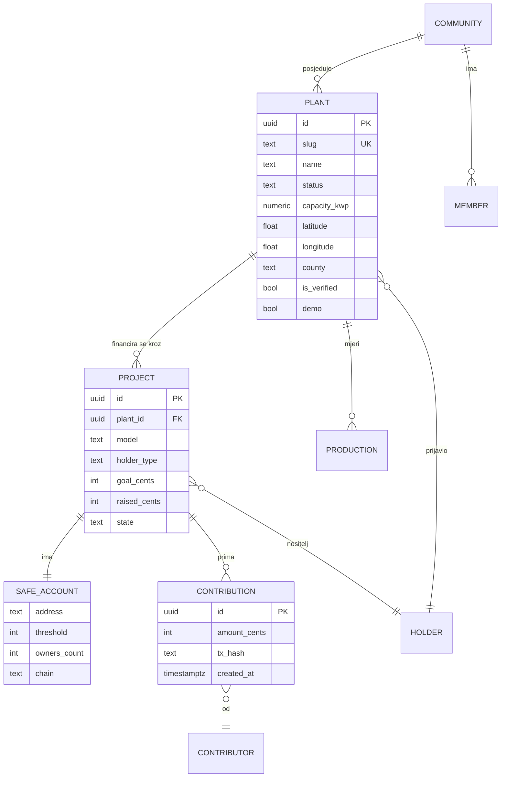
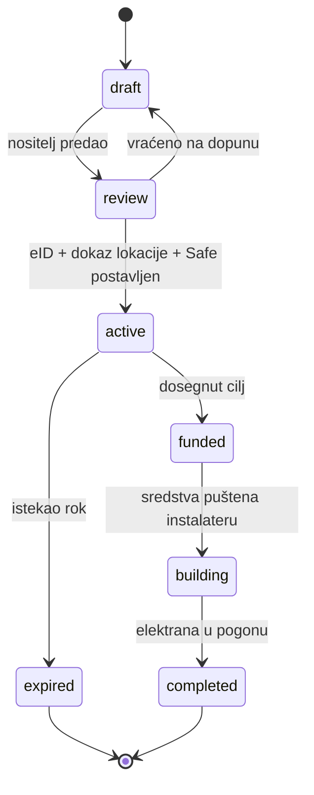

# 05 — Podatkovni model

Zadnja revizija: **15.9.2026.**

Ovaj model je **ugovor** koji vrijedi za mock podatke u prototipu i za kasniji
backend. Prototip ga mora poštovati doslovno, da migracija na pravi backend bude
zamjena sloja dohvaćanja, a ne prepisivanje UI-ja.

Polazi od `pinka-finance/app/lib/solar.ts` + `docs/energy-solar/DB-MIGRATION.sql`
(tablica `solar_plants`, već napisana i pregledana). **Zadržavamo imena polja gdje
god možemo** — taj rad ne treba ponavljati. Dodajemo ono što registar nije imao:
projekt financiranja, članove, doprinose, proizvodnju.

---

## 1. Entiteti



---

## 2. `plant` — elektrana (registar)

**Preuzeto 1:1 iz `solar.ts` / `DB-MIGRATION.sql`**, uz tri dodatka označena ➕.

| Polje | Tip | Napomena |
|---|---|---|
| `id` | uuid | |
| `slug` | text, unique | `solar_slugify()` — translit č/ć/đ/š/ž |
| `name` | text | |
| `description` | text? | |
| `latitude`, `longitude` | float? | marker na karti |
| `location_name` | text? | |
| `county` | text? | jedna od 21 (`HR_COUNTIES` u `solar.ts`) |
| `capacity_kwp` | numeric? | instalirana snaga |
| `status` | enum | vidi §2.1 |
| `commissioning_date` | date? | |
| `annual_production_kwh` | numeric? | procijenjena ili stvarna |
| `tech` | jsonb | paneli / inverteri / mreža |
| `hrote_id` | text? | vanjski registar; **OIB operatera se NE sprema u čistom obliku** |
| `cover_image_url` | text? | |
| `visibility` | `public\|unlisted\|private` | |
| `is_verified` | bool | **server-computed** iz eID-a, nikad iz klijenta |
| `campaign_slug` | text? | denormaliziran slug aktivnog projekta |
| ➕ `owner_type` | enum | `person \| association \| cooperative \| company \| municipality \| community` |
| ➕ `grid_status` | enum | vidi §2.2 |
| ➕ `demo` | bool | **true za sve seed podatke prototipa**; UI to mora prikazati |

### 2.1 `status` — životni ciklus elektrane

Iz `PlantStatus` u `solar.ts`, nepromijenjen:

```
planned → under_construction → operational → decommissioned
```

### 2.2 ➕ `grid_status` — priključak

Novo, jer je mreža usko grlo ([02](./02-trziste-hrvatska.md) §4, zahtjev
[E4](./03-pravni-okvir.md) §8):

| Vrijednost | Značenje |
|---|---|
| `not_applicable` | otočni rad, bez priključka |
| `not_requested` | zahtjev još nije predan |
| `requested` | predan zahtjev, uz `grid_requested_at` |
| `approved` | dobivena elektroenergetska suglasnost |
| `connected` | priključena i predaje u mrežu |
| `rejected` | odbijena — s razlogom |

> Projekt koji prikuplja novac za elektranu u stanju `not_requested` mora to
> **vidljivo reći na kartici.** To je najveći rizik za povjerenje u platformu.

---

## 3. `project` — projekt financiranja

Novo. Zamjenjuje pinkin `campaigns` + `subject_type='solar_plant'` obrazac
vlastitim entitetom, jer energetski projekt nosi polja koja kampanja nema.

| Polje | Tip | Napomena |
|---|---|---|
| `id` | uuid | |
| `plant_id` | uuid FK | elektrana koja se gradi/proširuje |
| `slug` | text, unique | |
| `title` | text | |
| `model` | enum | **`donation` \| `community`** — C/D onemogućeni ([E2](./03-pravni-okvir.md)) |
| `mode` | enum | **`integrated`** (mi smo izvođač i nositelj) \| **`byo`** (klijentove šine) — P1 ([14](./14-poslovni-model.md)) |
| `rails` | enum | `platform` \| `client` — čiji su Monerium IBAN i Safe. P2 |
| `contractor` | text? | tko gradi; u `integrated` modu to smo **mi** → obavezna objava sukoba interesa ([14](./14-poslovni-model.md) §4) |
| `cost_breakdown` | jsonb | razrada troška izvedbe, **javna prije uplate** (P5) |
| `milestones` | jsonb | plaćanje **po situaciji**, svaka uz potpise (P6) — vidi §4.1 |
| `holder_type` | enum | `association \| cooperative \| municipality \| company \| person \| community` — **prvo pitanje** ([E1](./03-pravni-okvir.md)) |
| `holder_name` | text | |
| `holder_oib` | text? | **prikazuje se, ne pretražuje**; za pravne osobe javan podatak |
| `goal_cents` | int | |
| `raised_cents` | int | izvedeno iz doprinosa, ne upisano ručno |
| `min_contribution_cents` | int | |
| `state` | enum | vidi §3.1 |
| `deadline` | date? | |
| `destination_address` | text | **Safe projekta**; nulta adresa ⇒ projekt ne smije biti javan |
| `site_right` | enum | `owner \| co_owner_consent \| building_right \| lease` — dokaz prava na lokaciju ([E6](./03-pravni-okvir.md)) |
| `site_right_doc_url` | text? | |
| `surplus_intent` | text? | izjava o namjeni viška ([E5](./03-pravni-okvir.md)) |
| `max_coowners` | int? | gornja granica suvlasnika (K2) — trošak administracije po članu je ono što je ubilo Sun Exchange ([13](./13-konkurencija.md) §5.1) |
| `demo` | bool | |

### 3.1 `state` — životni ciklus projekta



**Invarijante:**
- `active` zahtijeva sve troje: `is_verified` nositelja, `site_right` postavljen,
  `destination_address` ≠ nulta adresa.
- Prelazak `active → funded` traži `surplus_intent` ako je `raised > goal`.
- `funded → building` je **potpis na Safeu**, ne klik u našem sučelju. Mi ga
  prikazujemo, ne izvršavamo.

---

## 4. `safe_account` — račun projekta

| Polje | Tip | Napomena |
|---|---|---|
| `address` | text | `0x…`, 40 hex |
| `chain` | text | `gnosis` (chainId 100) |
| `threshold` | int | M |
| `owners` | text[] | N adresa |
| `platform_signer_count` | int | koliko je od tih potpisnika **naših**. U `byo` modu mora biti **0**. Vidi §4.1 |
| `source` | enum | `domovina-wallet-account` \| `legacy-derive` ([04](./04-financijska-arhitektura.md) §3.1) |
| `salt_nonce` | text? | kad dolazi iz wallet handoffa |
| `deployed` | bool | counterfactual dok je false |

> `threshold`/`owners` **moraju odgovarati statutu zajednice**
> ([04](./04-financijska-arhitektura.md) §3.2). Model to mora moći izraziti da
> bi UI mogao upozoriti na nesklad.

### 4.1 Invarijanta sukoba interesa (P7)

U `mode = integrated` **mi smo izvođač i ujedno jedan od potpisnika**. Zato:

> **Naš potpisnik nikad ne smije činiti većinu praga.** Ako je prag 3-od-5, mi
> držimo najviše **jedan** ključ. Konfiguracija u kojoj izvođač može sam sebi
> isplatiti novac poništava cijeli argument platforme
> ([14](./14-poslovni-model.md) §4).

Model to mora moći provjeriti: `platform_signer_count` vs `threshold`. UI odbija
spremiti projekt koji krši invarijantu.

**Točan uvjet — precizirano 15.9.2026. pri izvedbi.** „Većina" je **strogo više
od polovice**, pa je uvjet koji se krši:

```
platform_signer_count * 2 > threshold
```

Ne `>=`. Uz prag 3 većina je 2, pa je jedan naš ključ **dopušten** — točno kako
[14](./14-poslovni-model.md) §4 i kaže („prag 3-od-5 → najviše jedan ključ").
Prva izvedba je koristila `>=`, što je bilo **strože od pravila** i obaralo je
legitimnu 2-od-3 konfiguraciju. Implementacija: `violatesConflictInvariant()`
u `lib/types.ts`.

⚠️ **U Modu 2 (`byo`) ovaj uvjet nije dovoljan.** Ondje je Safe **klijentov** i
mi **nismo potpisnik uopće** ([14](./14-poslovni-model.md) §1), pa mora vrijediti
`platform_signer_count = 0`. To je jača tvrdnja od invarijante gore i provjerava
se zasebno — o njoj ovisi je li „ne držimo vaš novac" provjerljivo ili samo
marketinški.

---

## 5. `contribution` — doprinos / članski ulog

| Polje | Tip | Napomena |
|---|---|---|
| `id` | uuid | |
| `project_id` | uuid FK | |
| `amount_cents` | int | |
| `currency` | text | `EUR` (EURe je 1:1) |
| `rail` | enum | `sepa \| eure \| card` |
| `tx_hash` | text? | on-chain dokaz |
| `contributor_display` | text | ime ili „Anonimno" |
| `contributor_verified` | bool | prošao eID |
| `message` | text? | poruka na zidu |
| `created_at` | timestamptz | |

**Kod modela `community`** doprinos nosi dodatno:

| Polje | Tip | Napomena |
|---|---|---|
| `share_basis_points` | int | udio u zajednici, bazni bodovi (10000 = 100 %) |
| `member_id` | uuid FK | veza na članstvo |

⚠️ `share_basis_points` je **udio u proizvedenoj energiji i glasačkoj snazi**, ne u
dobiti. Naziv polja i svaki label u UI-ju moraju to nositi
([03](./03-pravni-okvir.md) §3). Nikad `yield`, `return`, `roi` ni `dividend` u
imenima polja — imena polja završe u API-ju i u screenshotovima.

---

## 6. `community` i `member` — zajednica

| `community` | Tip | Napomena |
|---|---|---|
| `id`, `slug`, `name` | | |
| `legal_form` | enum | `association \| cooperative \| not_yet_registered` |
| `registration_state` | enum | `idea \| preparing \| filed \| registered` |
| `oib` | text? | null dok nije registrirana |
| `statute_url` | text? | |
| `safe_address` | text | zajednički Safe |

`registration_state = idea|preparing` je **normalno i vidljivo stanje**, ne greška.
Cijela poanta je pratiti zajednicu prije nego pravno postoji
([03](./03-pravni-okvir.md) §5.3).

| `member` | Tip |
|---|---|
| `community_id`, `person_ref` | FK |
| `role` | `member \| board \| signer` |
| `share_basis_points` | int |
| `joined_at` | timestamptz |

---

## 7. `production` — proizvodnja (Faza 2)

| Polje | Tip | Napomena |
|---|---|---|
| `plant_id` | uuid FK | |
| `period` | date | mjesec ili dan |
| `kwh` | numeric | |
| `source` | enum | `manual \| inverter_api \| ods` |

**Faza 1: ne postoji.** Prikaz proizvodnje bez izvora je izmišljanje podataka.
Dok nema inverter API-ja ili ručnog unosa, elektrana u pogonu prikazuje samo
`annual_production_kwh` kao **procjenu**, jasno označenu.

---

## 8. Što se NE sprema

Jednako važno kao što se sprema.

- **OIB fizičke osobe u čistom obliku.** Naslijeđeno iz `DB-MIGRATION.sql`.
- **Privatni ključevi, seed fraze, passkey materijal.** Nikad, nigdje.
- **Podaci o potrošnji pojedinog člana.** To je osjetljiv podatak i nije nam
  potreban za ništa što gradimo.
- **Točna adresa elektrane fizičke osobe** kad je `visibility != public` —
  koordinate se zaokružuju na razinu naselja.

---

## 9. Mock podaci u prototipu

Konvencija iz `zef-novcanik-prototip` (SSOT `src/lib/mock.ts`) i
`airkuna/tokenizacija` (`data/properties.json`):

- **Jedna datoteka** `lib/mock.ts` (ili `data/*.json`) drži sve; ekrani su
  brand- i sadržaj-agnostični.
- **Svaki zapis nosi `demo: true`** i UI to prikazuje — traka, badge, ili oboje.
- Elektrane su **plauzibilne, ne stvarne**, dok ne postoji izvor. Kad se unesu
  stvarne, uz svaku ide izvor ([00](./00-indeks.md) pravilo 7).
- Safe adrese su **deterministički generirane iz slug-a**, oblika `0x` + 40 hex —
  da UI vježba pravi format, ali da nitko ne pošalje novac na njih.
