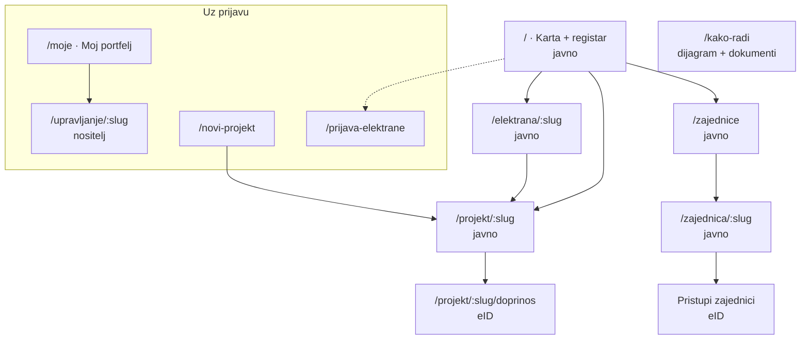
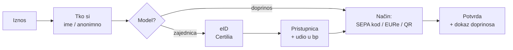
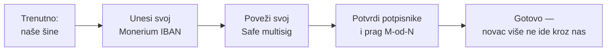

# 07 — Aplikacija / marketplace: specifikacija

Zadnja revizija: **15.9.2026.**

**Faza 1 = prototip, UI bez backenda.** Svi podaci iz `lib/mock.ts`, sve
„transakcije" simulirane, oznaka demo na svakom ekranu
([04](./04-financijska-arhitektura.md) §6).

---

## 1. Karta ekrana

---

## 2. Ekrani

### 2.1 `/` — Karta i registar (ulaz)

Najvažniji ekran. Radi bez prijave i bez ijednog projekta.

- **Karta** cijele Hrvatske s markerima elektrana ([08](./08-karta-i-geo.md)).
- **Prekidači slojeva:** sve elektrane · u pogonu · u izgradnji · **traže
  suradnju** (= imaju aktivan projekt) · zajednice.
- **Filtri:** županija (21, iz `HR_COUNTIES`), status, `grid_status`, raspon kWp.
- **Statistika** iznad karte: broj elektrana · ukupno MW · broj u pogonu · broj
  aktivnih projekata. Preuzeto iz postojećeg `energy/app/page.tsx`.
- **Popis/grid ispod karte**, sinkroniziran s filtrima.

⚠️ Karta i popis moraju gledati **isti** filtrirani skup. Najčešća greška u ovom
obrascu je da filtar mijenja popis, a ne kartu.

**K4 — trajna lista čekanja.** Kad nijedan projekt nije otvoren, ekran ne smije biti
slijepa ulica: „javi mi kad krene sljedeći projekt" mora postojati uvijek. ZEZ
zatvara pozive između projekata i nema gdje poslati zainteresirane
([13](./13-konkurencija.md) §2.2).

### 2.2 `/elektrana/:slug` — detalj elektrane

Postojeći `energy/app/elektrana/page.tsx` je polazište; proširiti s `grid_status`.

Sekcije: naslov + status badge · lokacija s mini-kartom · tehnički podaci
(kWp, paneli, inverteri, datum puštanja) · **status priključka** · procjena
godišnje proizvodnje (označena kao procjena) · vlasnik (`is_verified` badge) ·
**ako postoji projekt → istaknuta kartica s napretkom**.

### 2.3 `/projekt/:slug` — detalj projekta

Središnji ekran marketplacea. Struktura tabova posuđena iz
`airkuna/tokenizacija` (RealT obrazac), ali **bez ijednog financijskog obećanja**.

| Tab | Sadrži |
|---|---|
| **Pregled** | cilj, prikupljeno, broj doprinositelja, rok, **model** (doprinos / zajednica), nositelj + eID badge |
| **Elektrana** | tehnika, lokacija, status priključka, procjena proizvodnje |
| **Financiranje** | razrada troška: oprema, montaža, priključak, dokumentacija, rezerva. **Bez „očekivanog prinosa"** |
| **Račun** | Safe adresa, prag M-od-N, popis potpisnika (tko je od nas), poveznica na explorer, **oznaka demo**, poveznica „Prebaci na svoje šine" (§2.10) |
| **Situacije** | **P6** — plaćanje po napretku: temelj, oprema na gradilištu, montaža, puštanje u pogon. Svaka isplata uz potpise članova |
| **Knjiga doprinosa** | javni zid: iznos, ime/anonimno, poruka, vrijeme, tx |
| **Dokumenti** | dokaz prava na lokaciju, statut (kod zajednice), ponuda instalatera |
| **Tijek** | **K1** — vremenska crta od uplate do prve kWh: predano, prikupljeno, potpisano, naručeno, montirano, priključeno. Pomaci i **kašnjenja se vide**, ne šalju mailom |

**Trajno vidljivo, ne u fusnoti:** model financiranja i rečenica „Ne nudimo prinos
ni udio u dobiti" ([03](./03-pravni-okvir.md) §3).

**Objava sukoba interesa (P4)** — u `mode = integrated`, trajno na stranici, ne u
uvjetima:

> „Izvođač ovog projekta je domovina.energy. Isplata iz računa projekta traži M od N
> potpisa, a naš je jedan."

**Tab Financiranje nosi javnu razradu troška izvedbe (P5)** stavku po stavku —
oprema, montaža, dokumentacija, priključak, rezerva, **naša marža**. To je cijena
tvrdnje da ne uzimamo proviziju ([14](./14-poslovni-model.md) §3.1).

Za `model = community` dodatno: **udio u proizvedenoj energiji** u bazičnim
bodovima i što nosi (glas + kWh), nikad novac.

### 2.4 `/projekt/:slug/doprinos` — tijek doprinosa

Posuđuje `ContributePanel` + `PermanentQr` iz `pinka-finance/app`.

Kod modela `community` eID je **obavezan** — članstvo je pravni odnos
([04](./04-financijska-arhitektura.md) §5).

### 2.5 `/zajednice` i `/zajednica/:slug`

Ono što nitko drugi nema. Zajednica je vidljiva i **prije** nego pravno postoji
([05](./05-podatkovni-model.md) §6).

- Traka napretka registracije: `idea → preparing → filed → registered`.
- **Vodič sa stvarnim troškom i trajanjem** (20.000 €, 6+ mj.) i eksplicitno
  „ovo ne radimo umjesto vas" ([E9](./03-pravni-okvir.md) §8).
- Članovi, zajednički Safe, elektrane u vlasništvu.
- Predložak statuta za preuzimanje.

### 2.6 `/prijava-elektrane`

Postojeći `energy/app/prijava/page.tsx` + `registerPlant()` RPC. `VerifiedGate`
obrazac. **Besplatno i bez projekta** — ovo je akvizicijski kanal, ne lijevak.

### 2.7 `/novi-projekt` — čarobnjak

Redoslijed pitanja je pravno određen, ne UX preferencija
([E1](./03-pravni-okvir.md), [E2](./03-pravni-okvir.md)):

1. **Tko je nositelj?** (zajednica / udruga / zadruga / JLS / tvrtka / pojedinac)
   → grana sve dalje
2. **Koji model?** doprinos ili zajednica. C i D prikazani, **onemogućeni**, s
   objašnjenjem zašto — to je edukacijski trenutak, ne mrtav gumb
3. **Koja elektrana?** postojeća iz registra ili nova
4. **Pravo na lokaciju** — obavezno prije objave ([E6](./03-pravni-okvir.md))
5. **Cilj i razrada troška**
6. **Račun** — otvaranje Safea kroz wallet handoff
   ([04](./04-financijska-arhitektura.md) §3.1); kod zajednice i **prag M-od-N**,
   uz upozorenje da mora odgovarati statutu
7. **Opis** — validacija na zabranjene riječi ([E3](./03-pravni-okvir.md))
8. Pregled → predaja na `review`

⚠️ Nacrt se sprema u `sessionStorage` **prije** wallet handoffa i vraća se na
`dw_error` — naučeno u `pinka-finance/app/dashboard/new/page.tsx`.

### 2.8 `/moje` i `/upravljanje/:slug`

Portfelj: moje elektrane · moji projekti · moji doprinosi · moja članstva.
Upravljanje: uređivanje projekta, potpisi koji čekaju, objava novosti,
**generiranje izvješća iz on-chain podataka**.

> Automatsko izvješće je stvar u kojoj smo strukturno bolji od klasične platforme —
> svaki priljev je već javan i vremenski označen. Isto zapažanje kao
> `pravni-okvir-primanja-sredstava.md` §8.2.

### 2.10 `/projekt/:slug/sine` — „Prebaci na svoje šine" (P3)

Ono što tvrdnju „ne držimo vaš novac" čini provjerljivom
([14](./14-poslovni-model.md) §1). Mora biti **nekoliko klikova**, ne razgovor s
prodajom.

- Vrijedi za **N projekata** klijenta, ne samo jedan — postavka je na razini računa.
- Nakon prebacivanja `rails = client`, a mi **prestajemo biti potpisnik**.
- Ako i dalje želi nas kao izvođača, to je zaseban odnos: `mode` ostaje
  `integrated`, ali nas plaća sa svog Safea.
- **Ne skrivati iza postavki.** Poveznica stoji na stranici projekta, vidljivo.

### 2.11 `/kako-radi`

Dijagram toka novca (isti machine kao landing), objašnjenje Safea i EURe-a,
pravne granice, poveznice na dokumente. Mermaid obrazac postoji u
`pinka-finance/app/app/kako-radi/diagrams.ts`.

---

## 3. Prototip vs. puna verzija

| | Faza 1 (GEF) | Faza 2 |
|---|---|---|
| Podaci | `lib/mock.ts`, `demo: true` | Supabase `pinka_finance` |
| Karta | GeoJSON iz mocka | živi PostgREST |
| Prijava | simulirani eID gate | Certilia |
| Safe | mock adrese iz slug-a | wallet handoff |
| Doprinos | simulacija do potvrde | MPT rail |
| Proizvodnja | ne postoji | ručni unos → inverter API |

---

## 4. Konvencije

- **Mobile-first.** Publika na sajmu gleda na mobitelu.
- **Bez emojija u UI-ju.**
- **Nikad `any`.** `npm run verify` = lint + tsc + build prije svakog commita.
- Ekrani su **sadržaj-agnostični** — svi podaci iz mocka, po `zef-novcanik-prototip`
  obrascu. To omogućuje bijelu etiketu kasnije bez prepisivanja.
- **Deep-link** `?slug=` i `?screen=` na svakom ekranu — na sajmu se demo pokazuje
  otvaranjem točne stranice, ne klikanjem kroz pet koraka.
