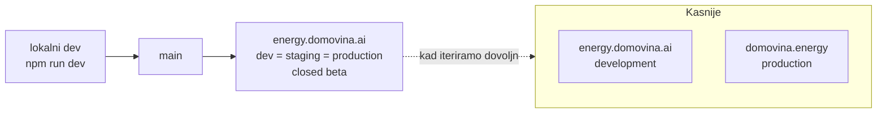

# 12 — Ime, domena i okruženja

Status: **odlučeno 15.9.2026.** Zamjenjuje raniji prijedlog imena (Prisoje i ostali
kandidati — **odbačeni**).

---

## 1. Odluka

| | Vrijednost |
|---|---|
| **Ime proizvoda** | **domovina.energy** |
| **Radna adresa (live)** | **energy.domovina.ai** |
| Repo | `domovinatv/energy.domovina.ai` |
| Faza | **closed beta** |
| Okruženja | **jedno** — development = staging = production |

`domovina.energy` je ime i rezervirana domena za javno lansiranje.
`energy.domovina.ai` je adresa na kojoj **stvarno živi** i na koju idemo live sad.

Kad projekt dovoljno iteriramo, `domovina.energy` postaje javna produkcija, a
`energy.domovina.ai` se **pretvara u razvojno okruženje**. Do tada je jedno te isto.

> **Zašto ime, a ne izmišljeni brand:** `domovina.energy` se drži obitelji
> (`domovina.ai`, `pay.domovina.ai`, `gis.domovina.ai`), ne traži objašnjenje i ne
> troši ništa na izgradnju prepoznatljivosti nove riječi. Kandidati tipa *Prisoje*
> nosili su trošak objašnjavanja koji u ovoj fazi nema tko platiti.

---

## 2. Jedno okruženje — što to konkretno znači

**Nema `dev` / `staging` / `prod` odvajanja.** Grana `main` je ono što ljudi vide.
To je svjesna odluka za fazu u kojoj je brzina iteracije važnija od zaštitnih
slojeva, i ima cijenu koju treba znati unaprijed.



### 2.1 Pravila koja iz toga slijede

1. **Svaki push u `main` je objava.** Nema „probat ću na stagingu".
   `npm run verify` (lint + tsc + build) prolazi **prije** commita, bez iznimke.
2. **Closed beta je jedini zaštitni sloj.** Pristup se kontrolira na ulazu
   (§3), ne postojanjem odvojenog okruženja.
3. **Oznaka prototipa je obavezna, ne stilska.** Kad je produkcija ujedno i
   razvoj, posjetitelj mora iz same stranice znati u što gleda. `demo: true`
   traka ostaje dok podaci nisu stvarni (`docs/09` §6.4, `CLAUDE.md` pravilo 3).
4. **Nikakve destruktivne migracije.** Kad dođe backend (Faza 2), migracije su
   samo aditivne — nema `drop column` na živom okruženju bez rezervne kopije i
   prethodne najave.
5. **Nedovršeno ide iza zastavice**, ne u zasebnu granu koja čeka. Poluimplementiran
   ekran na `main` bez zastavice = poluimplementiran ekran u produkciji.
6. **Rollback mora biti trivijalan.** Statički export na Cloudflareu — vraćanje na
   prethodni deploy je jedna radnja. To je dio razloga zašto je jedno okruženje
   podnošljivo.

### 2.2 Kada se okruženja razdvajaju

Ne po kalendaru, nego kad nastupi prvi od ovih uvjeta:

- postoji **backend s pravim podacima** (Faza 2) — dijeljena baza između razvoja i
  produkcije je trenutak kad jedno okruženje prestaje biti podnošljivo;
- postoji **pravi novac** na pravom Safeu;
- beta se otvara **izvan pozvanog kruga**.

---

## 3. Closed beta

| | |
|---|---|
| Tko ulazi | pozvani — ZEZ, potencijalni nositelji projekata, ljudi s GEF-a |
| Kako | ⚠️ **otvoreno** — vidi §6 |
| Što vide | puni prototip s `demo` podacima |
| Indeksiranje | **`robots.txt` zabranjuje**, `noindex` meta |

⚠️ Closed beta **ne smije** biti izgovor za labavost oko pravnih granica
(`docs/03` §3). Zatvoreni krug i dalje je javna objava u pravnom smislu — rečenica
koja obećava prinos jednako je problematična pred deset ljudi kao pred tisuću.

---

## 4. Tehničke posljedice odabira domene

Ovo je razlog zašto odluka o domeni nije kozmetička (ranija blokada B2).

| Sloj | Na `energy.domovina.ai` (sad) | Na `domovina.energy` (kasnije) |
|---|---|---|
| **Passkey RP ID** | `domovina.ai` ili `energy.domovina.ai` | `domovina.energy` |
| Dijeljenje passkeya s walletom | ✅ **moguće** — `wallet.domovina.ai` je isti registrable domain | ❌ **nije** — drugi eTLD+1 |
| Certilia `ALLOWED_ORIGINS` | `https://energy.domovina.ai` | + `https://domovina.energy` |
| CSP `connect-src` / `frame-src` | origin-pin na `*.domovina.ai` | proširiti |
| Cloudflare | zona `domovina.ai` | zona `domovina.energy` |

### ⚠️ Zamka koju treba zapisati sad, dok je jeftino

**WebAuthn passkeyi su vezani uz registrable domain i ne migriraju.** Passkey
stvoren pod `domovina.ai` **neće raditi** na `domovina.energy`. Ako se u closed beti
korisnicima kreiraju pravi passkeyi na `energy.domovina.ai`, a poslije se produkcija
preseli na `domovina.energy`, ti ljudi **gube pristup računima** ako se ne
pripremi put oporavka.

Dvije posljedice:

1. U closed beti (Faza 1) passkey je **simuliran** (`docs/04` §6) — nema pravih
   ključeva, pa nema ni problema. **Držati se toga.**
2. Prije nego se ikome kreira **pravi** passkey, mora biti odlučeno na kojoj domeni
   produkcija trajno živi. Isti obrazac kao napomena u
   `pinka-finance/app/docs/energy-solar/PLAN.md` §d.4 — wallet radi kroz iframe pod
   `domovina.ai`, pa to nije blokada, ali passkeyi se **ne dijele** preko granice
   eTLD+1.

---

## 5. Ime u kodu

Ime se **ne hardkodira** u copy ni u komponente — ide preko konstante, jer se
prelazak `energy.domovina.ai` → `domovina.energy` mora svesti na jednu izmjenu.

```ts
// lib/brand.ts
export const BRAND = {
  name: "domovina.energy",          // ime proizvoda u copyju
  liveUrl: "https://energy.domovina.ai", // gdje stvarno živi (closed beta)
  publicUrl: "https://domovina.energy",  // rezervirano za javno lansiranje
  stage: "closed-beta",             // "closed-beta" | "public"
} as const;
```

Isti obrazac kao `config/brands/` u `airkuna/tokenizacija` — priprema i za bijelu
etiketu kasnije (`docs/10` §5).

---

## 6. Otvoreno

- [ ] **Kako se tehnički zatvara beta?** Kandidati: Cloudflare Access (najčišće,
      postoji u obitelji), zajednička lozinka na Workeru, ili samo neindeksirana
      adresa koja se dijeli linkom. Odluka utječe na to može li se link dijeliti na
      sajmu.
- [ ] Je li `domovina.energy` **registriran i na ITalk d.o.o.**, i u kojoj CF zoni.
- [ ] Žig — DZIV/EUIPO pretraga prije javnog lansiranja (niži prioritet nego kod
      izmišljenog imena, ali ne nula).
- [ ] `robots.txt` + `noindex` od prvog deploya, da closed beta ne završi u
      tražilicama.
