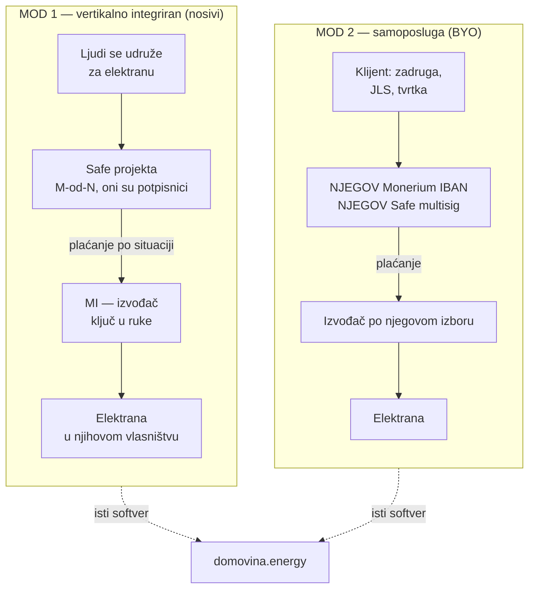

# 14 — Poslovni model: vertikalno integriran izvođač + platforma

Odlučeno: **15.9.2026.** Zamjenjuje raniju pretpostavku iz [04](./04-financijska-arhitektura.md)
§4.1 da nemamo prihodovni model.

> **Jedna rečenica:** ne posredujemo tuđa ulaganja — **gradimo elektrane i prodajemo
> ih ključ u ruke**, a novac za njih prikupljamo od ljudi koji tu elektranu dobivaju.
> Tko želi, isti alat može koristiti s vlastitim računom i bez nas u sredini.

---

## 1. Dva moda rada

| | **Mod 1 · Vertikalno integriran** | **Mod 2 · Samoposluga (BYO)** |
|---|---|---|
| Tko je nositelj | **mi** (ili zadruga koju ugošćujemo) | **klijent** |
| Tko gradi | **mi** — ključ u ruke | izvođač po klijentovom izboru |
| Čiji je Safe | projekta; mi smo **jedan od** potpisnika | **klijentov**, mi nismo potpisnik |
| Čiji IBAN | naš Monerium | **klijentov** Monerium |
| Prolazi li novac kroz nas | **da**, kao naplata izvedbe | **ne, nikad** |
| Naša uloga | izvođač + softver | **samo softver** |
| Kako se uključuje | zadano | **nekoliko klikova** ([07](./07-produkt-app.md) §2.10) |
| Prihod | **marža na izvedbi** | bijela etiketa / konzalting / ništa |
| Uzor | **ZEZ** ([13](./13-konkurencija.md) §2) | pinka / mpt non-custodial framing |

**Mod 2 nije ustupak nego dokaz.** Mogućnost da klijent u nekoliko klikova prebaci
sve na svoje šine je ono što tvrdnju „ne držimo vaš novac" čini provjerljivom, a ne
marketinškom. Ujedno je i izlaz ako mi nestanemo ([01](./01-vizija-i-pozicioniranje.md) §5).

---

## 2. Zašto nijedan mod ne traži ECSP

Ovo je središnji argument i mora biti točan u detalju, jer će ga netko na GEF-u
provjeriti.

### 2.1 Mod 1 — nema posredovanja, nema instrumenta

**ECSPR uređuje posrednika** koji spaja **treće** nositelje projekata s
ulagateljima, i to samo kod **zajmova** i **prenosivih vrijednosnih papira**
([03](./03-pravni-okvir.md) §3). U Modu 1 ne postoji ni jedno ni drugo:

| Uvjet ECSPR-a | Kod nas u Modu 1 |
|---|---|
| Postoji **treći** nositelj projekta | ❌ nositelj smo **mi** ili zadruga koju ugošćujemo — nema koga spajati |
| Instrument je **zajam** | ❌ nije — vidi §2.2 |
| Instrument je **prenosivi vrijednosni papir** | ❌ nije — zadružni udjel nije prenosiv niti utrživ |

**Ključ je u tome što uplatitelj dobiva**, ne u tome kako je novac stigao.

### 2.2 Što uplatitelj zapravo dobiva — tri čista slučaja

| Slučaj | Pravna narav uplate | Što nastaje | Regulativa |
|---|---|---|---|
| **1a · Skupna kupnja** — grupa kupuje elektranu, mi gradimo | **predujam na ugovor o djelu / građenju** | vlasništvo nad elektranom | trgovačko + **potrošačko** pravo, PDV, fiskalizacija |
| **1b · Zadruga** — članovi ulažu u zadrugu, zadruga naručuje od nas | **zadružni udjel** (član ↔ zadruga) + **ugovor o djelu** (zadruga ↔ mi) | članstvo, glas, energija | zadružno + energetsko pravo |
| **1c · Donacija** — građani financiraju krov škole, mi gradimo | **darovanje** (donator ↔ škola) + **ugovor o djelu** (škola ↔ mi) | elektrana kod korisnika | ZHP/porez ako je humanitarno |

> **Najvažnija posljedica:** u slučaju 1a novac **nije ulaganje nego predujam na
> kupoprodaju**. To ga vadi iz financijske regulative u cijelosti. Nije „rupa" —
> to je doslovno ono što jest: naručili su elektranu i platili je unaprijed.

### 2.3 Crta koju ne smijemo prijeći ni u jednom modu

**Uplata se nikad ne smije opisati kao povratna.** Čim uplatitelj daje novac s
očekivanjem da ga **dobije natrag s prinosom**, to više nije ni predujam ni
članski udjel nego:

- **zajam** → ECSPR, ili
- **primanje povratnih sredstava od javnosti** → to je **bankovni posao**, rezervirana
  djelatnost po Zakonu o kreditnim institucijama. **Strože od ECSPR-a, ne blaže.**

| Formulacija | Status |
|---|---|
| „Uplatom naručuješ svoj dio elektrane." | ✅ 1a |
| „Kao član zadruge imaš glas i dio energije." | ✅ 1b |
| „Financiraš krov svoje škole." | ✅ 1c |
| „Uloži pa ti vraćamo kroz godine." | ❌ **zajam / bankovni posao** |
| „Ako projekt ne uspije, vraćamo ti novac s kamatom." | ❌ isto |

⚠️ **Povrat predujma ako projekt propadne nije zajam** — to je raskid ugovora i
povrat plaćenog. Razlika je u tome što se **ne obećava prinos** i što je povrat
posljedica neisporuke, a ne plan. To mora biti tako napisano u uvjetima (§5).

### 2.4 Mod 2 — što nas stvarno štiti (i što ne)

⚠️ **Ne štiti nas to što novac ne prolazi kroz nas.** ECSPR **ne traži
skrbništvo** — hvata posredovanje neovisno o tome tko drži sredstva. Platforma
koja spaja treće nositelje s javnošću može biti ECSP i bez da ikad dotakne euro.

**Štiti nas to što su instrumenti izvan opsega.** Donacija i zadružni udjel nisu ni
zajam ni prenosivi vrijednosni papir, pa ECSPR ne ulazi u igru bez obzira na
posredovanje.

> **Posljedica:** ograničenje modela iz [03](./03-pravni-okvir.md) §3 (samo A i B)
> nije stilsko pravilo nego **jedina stvar koja Mod 2 drži izvan licence**. U
> trenutku kad bi netko kroz našu platformu ponudio zajam uz kamatu, bili bismo ECSP
> — i ne bi pomoglo što je novac išao mimo nas. Zato validacija na zabranjene riječi
> ([E3](./03-pravni-okvir.md)) i onemogućeni modeli C/D ([E2](./03-pravni-okvir.md))
> **nisu kozmetika nego kontrola usklađenosti**.

---

## 3. Prihodovni model — imamo ga

Ovo poništava egzistencijalnu zabrinutost iz [04](./04-financijska-arhitektura.md) §4.2.

| Izvor | Mod | Napomena |
|---|---|---|
| **Marža na izvedbi** ključ u ruke | 1 | **glavni prihod** — oprema, montaža, dokumentacija, priključak |
| Održavanje i monitoring | 1 | ponavljajući, nakon puštanja u pogon |
| Bijela etiketa / konzalting | 2 | isti obrazac kao pinka (MIT kod + plaćena implementacija) |
| Javni / EU natječaji | oba | energetske zajednice su prioritet EU politike |
| **Provizija na prikupljena sredstva** | — | ❌ **nikad** — ruši i tvrdnju i pozicioniranje |

### 3.1 Kako sad glasi tvrdnja o 0 %

Stara formulacija („bez provizije") ostaje istinita, ali **sama nije poštena** ako
istovremeno zarađujemo kao izvođač. Točna formulacija:

> **Ne uzimamo postotak od prikupljenog novca.** Zarađujemo kao izvođač — na izgradnji
> elektrane, i **cijena izvedbe je javna** u razradi troška svakog projekta.

To je jača tvrdnja od pukog „0 %", jer je provjerljiva: trošak izvedbe stoji u tabu
**Financiranje** ([07](./07-produkt-app.md) §2.3), stavku po stavku.

⚠️ **Zabranjeno:** reći „0 % naknada" bez da u istom vidnom polju stoji da smo
izvođač i da na tome zarađujemo. To bi bilo obmanjujuće i najlakše oborivo na sajmu.

---

## 4. Sukob interesa — strukturni je, i priznaje se

Istovremeno smo **platforma koja prikazuje projekt** i **izvođač koji naplaćuje**.
To je stvaran sukob, ne privid. ZEZ ima isti. Rješenje nije poricanje nego tri
mehanizma:

| Mehanizam | Kako radi |
|---|---|
| **Safe M-od-N u kojem mi nismo većina** | ne možemo si isplatiti bez potpisa članova. **Ovo je glavna zaštita** i pravi razlog zašto multisig nije ukras |
| **Javna razrada troška** | svaka stavka izvedbe vidljiva prije uplate |
| **Mod 2 kao izlaz** | klijent u nekoliko klikova može uzeti drugog izvođača i zadržati softver |

> **Dizajnersko pravilo:** u Modu 1 naš potpis **nikad ne smije biti dovoljan** za
> isplatu iz Safea projekta. Ako je prag 3-od-5, mi držimo najviše jedan ključ.
> Konfiguracija u kojoj izvođač može sam sebi platiti poništava cijeli argument.

**Objava sukoba interesa** ide na stranicu projekta trajno, ne u uvjete:
„Izvođač ovog projekta je domovina.energy. Isplata iz računa projekta traži M od N
potpisa, a naš je jedan."

---

## 5. Što se seli iz financijske u potrošačku regulativu

Mod 1 nas vadi iz ECSPR-a, ali nas stavlja u režim koji ima vlastite obveze. **Ovo
nije manji rizik, nego drukčiji i upravljiviji.**

| Obveza | Izvor | Status |
|---|---|---|
| **Račun + PDV** na izvedbu | Zakon o PDV-u | mi smo d.o.o. u sustavu PDV-a |
| **Fiskalizacija 2.0 / eRačun** | od **1.1.2026.** | ⚠️ već na snazi |
| **Predujam potrošača** — rokovi, pravo na raskid, povrat | Zakon o zaštiti potrošača | ⚠️ **otvoreno, za pravnika** |
| **Rizik nesolventnosti na predujmu** | — | ⚠️ ako uzmemo novac i ne isporučimo, kupci su neosigurani vjerovnici |
| **Registracija djelatnosti** izvođenja elektroinstalacijskih radova | — | ⚠️ **otvoreno** — provjeriti što traži izvedba FN sustava |
| Ovlašteni inženjer / atesti | — | ⚠️ **otvoreno** |

### 5.1 Kako Safe rješava rizik predujma

Ovo je najelegantniji dio cijele konstrukcije i treba ga iskoristiti eksplicitno.

**Ako novac stoji u Safeu čiji su potpisnici kupci, a ne mi, to nije predujam koji
smo primili — to je sredstvo u zajedničkoj pohrani koje se otpušta po napretku.**
Mi ga naplaćujemo **po situaciji** (temelj, oprema na gradilištu, montaža, puštanje
u pogon), svaki put uz potpise članova.

Posljedice:
- kupci **nisu** neosigurani vjerovnici — novac nikad nije ušao u našu imovinsku masu
  dok nije zarađen;
- ako mi propadnemo, novac koji nije isplaćen **ostaje njima**;
- to je ista invarijanta koja je spasila Ripple zadruge ([13](./13-konkurencija.md) §4.1),
  samo primijenjena na odnos s izvođačem.

⚠️ **Za pravnika:** je li ovakav aranžman u hrvatskom pravu **escrow/pohrana** ili
se ipak smatra primljenim predujmom u trenutku uplate u Safe? O tome ovisi i porezni
trenutak nastanka obveze PDV-a. Dodano u [03](./03-pravni-okvir.md) §9.

### 5.2 Kašnjenje je sad i pravni, ne samo reputacijski problem

Ripple je izgubio povjerenje na kašnjenjima i lošoj komunikaciji (Trustpilot 2,6 —
[13](./13-konkurencija.md) §4.2). Kad smo **mi izvođač**, kašnjenje više nije tuđa
greška koju prenosimo dalje — to je **naše neispunjenje ugovora**.

Zato K1 (tab **Tijek** s vidljivim pomacima i kašnjenjima,
[07](./07-produkt-app.md) §2.3) prestaje biti UX finesa i postaje **higijena
usklađenosti**: dokumentirani rokovi i njihove izmjene su ono što se gleda u sporu.

---

## 6. Što ovo mijenja u proizvodu

| # | Izmjena | Gdje |
|---|---|---|
| **P1** | `project.mode`: `integrated` \| `byo` — mod rada je polje, ne pretpostavka | [05](./05-podatkovni-model.md) §3 |
| **P2** | `project.rails`: čiji su Monerium IBAN i Safe (`platform` \| `client`) | [05](./05-podatkovni-model.md) §4 |
| **P3** | **Ekran „Prebaci na svoje šine"** — BYO u nekoliko klikova | [07](./07-produkt-app.md) §2.10 |
| **P4** | **Objava sukoba interesa** trajno na stranici projekta u Modu 1 | §4 |
| **P5** | **Razrada troška izvedbe** stavku po stavku, javna prije uplate | §3.1 |
| **P6** | **Plaćanje po situaciji** — milestones kao entitet, svaki uz potpise | §5.1 |
| **P7** | Validacija: naš potpisnik **nikad ne čini većinu** praga Safea | §4 |
| **P8** | Copy „0 %" **nikad bez** napomene da smo izvođač | §3.1 |

---

## 7. Otvoreno

- [ ] **Pravni oblik nositelja u Modu 1.** Jesmo li mi (ITalk d.o.o.) nositelj, ili
      osnivamo/ugošćujemo **zadrugu** kao ZEZ? Zadruga je čišća za slučaj 1b i
      izbjegava da d.o.o. prima predujmove od desetaka potrošača, ali traži
      osnivanje ([02](./02-trziste-hrvatska.md) §3: 20.000 €, 6+ mj.).
- [ ] **Escrow ili predujam?** (§5.1) — određuje i trenutak nastanka obveze PDV-a.
- [ ] **Registracija djelatnosti izvođenja** i tko potpisuje kao ovlašteni inženjer.
- [ ] **Potrošački predujmi** — rokovi, raskid, povrat; treba li jamstvo.
- [ ] Kapacitet izvedbe: koliko projekata istovremeno možemo stvarno izgraditi?
      Model bez kapaciteta je obećanje koje proizvodi Rippleov Trustpilot.
- [ ] Partnerstvo s postojećim instalaterom kao alternativa vlastitoj izvedbi —
      brže, manja marža, manji rizik.
