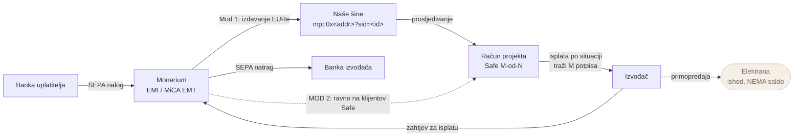

# 2026-09-15 — Dnevnik izvedbe: odluke o stacku, zamke i ispravci (Faza 1a–1c)

Parnjak [istraživačkog dnevnika](./2026-09-15-istrazivacki-dnevnik.md), ali za
**kod**. Onaj nosi što je provjereno o tržištu; ovaj nosi zašto stack izgleda
ovako, što je koštalo vremena, i koje su tvrdnje iz `docs/` pri izvedbi morale
biti precizirane.

Pokriva kod od početka: `94b7db7` (Faza 1a + 1b), `c87afbe` (ispravci karte) i
Fazu 1c (marketplace) — §7 niže.

**Vezani dokumenti:** [05-podatkovni-model](./05-podatkovni-model.md) ·
[06-produkt-landing](./06-produkt-landing.md) §5 ·
[11-plan-izvedbe](./11-plan-izvedbe.md) · [14-poslovni-model](./14-poslovni-model.md) §4

---

## 1. ⚠️ Zamka koja je koštala najviše: maplibre worker pod Turbopackom

**Ovo je najvrjednija stavka u dokumentu.** Simptom je takav da navodi na krivi
trag, a rješenje je u tri retka.

**maplibre-gl 6 pod Next 16 / Turbopackom ne podigne svoj worker.** Traži ga
preko `import.meta.url` i tiho odustane ako to nije `http(s):` URL:

```js
// iz maplibre-gl.mjs
let e = import.meta.url;
if (!/^https?:/.test(e)) return ``;          // ← Turbopack ovdje padne
return new URL(`./maplibre-gl-worker.mjs`, e).href;
```

### Zašto je simptom varljiv

Sve što se provjerava prvo — **izgleda ispravno**:

| Provjera | Rezultat |
|---|---|
| `<canvas>` postoji, ima točnu veličinu | ✅ 2204×1120 |
| WebGL2 dostupan | ✅ |
| Stil (`/styles/positron`) | ✅ 200 |
| Sprite (`ofm@2x.json`, `.png`) | ✅ 200 |
| TileJSON (`/planet`) | ✅ 200 |
| **Vektorske pločice (`.pbf`)** | ❌ **nijedna** |
| `map.loaded()` | ❌ zauvijek `false` |
| **Greška u konzoli** | ❌ **nijedna** |

Sve što ide glavnom dretvom radi; sve što ide kroz worker je mrtvo. Karta je
prazna, a ništa ne prijavljuje kvar.

### Dijagnoza u jednom retku

```js
performance.getEntriesByType('resource')
  .filter(e => /\.pbf|maplibre-gl-worker/.test(e.name)).length   // 0 ⇒ ovo je to
```

### Rješenje

`setWorkerUrl()` je javni API, i mora se pozvati **prije prvog `new Map(...)`** —
poslije se worker pool već podigao s praznim URL-om.

Worker se poslužuje s **vlastite domene, ne s CDN-a**: demo na sajmu mora raditi
bez mreže ([06](./06-produkt-landing.md) §6). `scripts/copy-maplibre-worker.mjs`
kopira **obje** datoteke pri `predev`/`prebuild`:

- `maplibre-gl-worker.mjs`
- `maplibre-gl-shared.mjs` — worker ga uvozi **relativno u odnosu na sebe**, pa
  moraju stajati jedan uz drugi

`public/maplibre/` je u `.gitignore`. Vendorirati 500 kB tuđeg minificiranog
koda znači da će se razići s verzijom u `package.json`; generiranje pri buildu
to ne može.

⚠️ Ovo vrijedi i za **svaki drugi repo u obitelji koji pređe na Next 16** —
`gis.domovina.ai` i `karta-hrvatske` su na maplibreu ([08](./08-karta-i-geo.md) §5).

---

## 2. ⚠️ Druga maplibre zamka: `zoom` izraz se ne smije ugnijezditi

```js
// ❌ maplibre odbija sloj, uz grešku u `map.on("error")`
"circle-radius": ["+", MARKER_RADIUS_EXPRESSION, 5]
//   "zoom expression may only be used as input to a top-level
//    step or interpolate expression"
```

Izraz koji čita `["zoom"]` smije stajati **samo kao vrh** `step`/`interpolate`
izraza. Prsten oko elektrana koje traže suradnju ([08](./08-karta-i-geo.md) §3.1
traži „puni krug + prsten") zato ne može biti polumjer markera + 5.

Rješenje: oba polumjera nastaju iz **istog izvora** (`RADIUS_STOPS` u
`lib/map-colors.ts`) s odmakom upisanim u svaku točku, pa se ne mogu razići.

> **Pouka o postupku, ne o maplibreu:** ovu je grešku uhvatio
> `map.on("error", …)` handler koji je bio na mjestu od početka. Bez njega bi
> sloj tiho nedostajao. Registrirati error handler na karti **prije** nego se
> dodaju slojevi.

---

## 3. ⚠️ Zamka u provjeri, ne u kodu: skrivena kartica pauzira `requestAnimationFrame`

Kad se karta provjerava kroz automatizirani preglednik, a prozor je prekriven
ili kartica nije aktivna:

```js
document.visibilityState  // "hidden"
// requestAnimationFrame se NE izvršava → maplibre nikad ne nacrta prvi frame
```

Simptom je **identičan** onome iz §1, pa jedan uzrok maskira drugi. Na ovoj
sesiji su oba bila istinita odjednom, i prvo je zaključeno da je kriva samo
skrivena kartica — što je bilo netočno.

**Ne pomaže:** klik u stranicu, promjena veličine prozora, ni
`osascript -e 'tell application "Brave Browser" to activate'` — fokus se dobije
(`document.hasFocus()` postane `true`), ali `visibilityState` ostaje `hidden`.
Jedino pomaže da čovjek klikne na prozor.

**Ne pokušavati zaobići** ručnim pozivom `map._render()` — zamrzne renderer i
sruši CDP vezu (`Runtime.evaluate timed out`).

> **Pravilo:** `visibilityState: "hidden"` znači **odgodi zaključak**, ne „kod je
> ispravan". „Canvas postoji, WebGL radi, zahtjevi 200" isključuje neke uzroke,
> ali ne dokazuje da karta radi.

---

## 4. Odluke o stacku — i što je odbačeno

Sve provjereno na npm-u 15.9.2026., ne po sjećanju.

| Izbor | Uzeto | Odbačeno | Zašto |
|---|---|---|---|
| Framework | **Next 16.3.5** | Next 15 | Zamke iz `mpt-landing/CLAUDE.md` (`proxy.ts`, `dynamicParams`) tiču se **OpenNexta**, a mi idemo na **statički export** — ne vrijede. Obitelj je ionako na 16 |
| Tailwind | **3.4.19** | Tailwind 4.3 | v4 je CSS-first (`@theme`); tokeni iz [09](./09-dizajn-sustav.md) i komponente koje preuzimamo iz `pinka-finance/energy` pisani su za v3 (`border-ink/8` traži `opacity` extend). v4 bi značio prepisati token sloj i raziđi se s obitelji |
| ESLint | **9.39.5** | ESLint 10.10 | `eslint-plugin-react`, koji donosi `eslint-config-next` 16, **ne radi** na ESLintu 10: `TypeError: contextOrFilename.getFilename is not a function`. Vratiti na 10 tek kad `eslint-config-next` osvježi taj plugin |
| Bazne pločice | **OpenFreeMap positron** | vlastiti pmtiles | Bez ključa, ista podloga kao `karta-hrvatske` ([08](./08-karta-i-geo.md) §5). pmtiles ostaje za offline build (1e) |

### Druge zatečene razlike u Nextu 16

- **`next lint` je uklonjen.** `package.json` zove `eslint .` izravno.
- **`eslint-config-next` ima native flat config** (`eslint-config-next/core-web-vitals`,
  `/typescript`) — `FlatCompat` nije potreban.
- **`next dev` dopisuje blok u `CLAUDE.md`** (`<!-- BEGIN:nextjs-agent-rules -->`).
  Generira ga `node_modules/next/dist/server/lib/generate-agent-files.js`; brisanje
  ga samo vrati pri sljedećem `dev`, pa se commita zajedno s radom.
- **`next build` prepisuje `tsconfig.json`** — postavlja `jsx: "react-jsx"` i
  dodaje `.next/dev/types`. Očekivano, ne boriti se s tim.

---

## 5. Ispravci koje su izvukli testovi invarijanti

Oba su bila **neslaganje koda s `docs/`**, ne obična greška — zato su vrijedni.

### 5.1 Invarijanta sukoba interesa bila je stroža od pravila

Prva izvedba `violatesConflictInvariant()`:

```ts
return safe.platform_signer_count * 2 >= safe.threshold;   // ❌ prestrogo
```

[14](./14-poslovni-model.md) §4 kaže „nikad ne smije činiti **većinu** praga", a
većina je **strogo više od polovice**. Uz prag 3 većina je 2, pa je jedan naš
ključ dopušten — i sam dokument to potvrđuje („prag 3-od-5 → najviše jedan
ključ"). S `>=` je padala legitimna 2-od-3 konfiguracija.

Točan uvjet je `> `, i sada stoji u [05](./05-podatkovni-model.md) §4.1 da se
pravilo ne mora ponovno izvoditi iz teksta.

### 5.2 U Modu 2 smo bili upisani kao potpisnik, a ne smijemo biti

`safeFor()` je svakom projektu upisivao `platform_signer_count: 1`, pa i onima s
`mode: "byo"`. Ali u Modu 2 je Safe **klijentov** i mi **nismo potpisnik uopće**
([14](./14-poslovni-model.md) §1).

To nije kozmetika: mogućnost da klijent u nekoliko klikova prebaci sve na svoje
šine je ono što tvrdnju „ne držimo vaš novac" čini **provjerljivom** umjesto
marketinškom ([14](./14-poslovni-model.md) §1). Ako u podacima stoji naš ključ na
klijentovom Safeu, tvrdnja pada.

> **Pouka:** invarijante iz `docs/` pisati kao **testove**, ne kao komentare.
> Oba su ispravka izašla iz `lib/__tests__/invariants.test.ts`, ne iz čitanja koda.

---

## 6. Odluke u izvedbi koje `docs/` nisu propisali

### 6.1 Filtri žive u URL-u, ne u `useState`

[07](./07-produkt-app.md) §2.1 traži da karta i popis gledaju **isti** filtrirani
skup. Izvedeno tako da `filterPlants()` stoji **jednom** u
`components/registry.tsx` i hrani kartu, popis i statistiku — greška na koju
dokument upozorava nije moguća bez namjernog razdvajanja jedne varijable.

Uz to, sami filtri su u URL-u (`useSyncExternalStore` nad `location.search`), a
ne u lokalnom stanju. Posljedica: **deep-linkovi iz [06](./06-produkt-landing.md) §6
stižu besplatno**, a „natrag" i „podijeli ovaj pogled" rade sami od sebe. Bilo bi
skuplje zrcaliti stanje u dva smjera nego imati jedan izvor.

### 6.2 Dug provjere je onemogućen strukturno, ne disciplinom

V1–V8 iz [istraživačkog dnevnika](./2026-09-15-istrazivacki-dnevnik.md) §3 stoje u
`lib/facts.ts` kao `PENDING_VERIFICATION`, i **nemaju polje `value`**. Nije ih
moguće formatirati u UI ni greškom; test to čuva. Potvrđene brojke imaju `value`,
`source`, `verifiedAt` i `doc`.

### 6.3 Odobrene negacije u lintu su doslovne rečenice, ne uzorak

`scripts/check-copy.ts` blokira zabranjene riječi ([03](./03-pravni-okvir.md) §3,
zahtjev E3). Problem: [07](./07-produkt-app.md) §2.3 **traži** da rečenica „Ne
nudimo prinos ni udio u dobiti." bude trajno vidljiva — a odricanje mora imenovati
ono čega se odriče.

Odbačeno rješenje: uzorak „dopusti ako je negirano". Propustio bi svako „ne nudimo
prinos, **ali**…".

Uzeto: popis **doslovnih rečenica** (`APPROVED_NEGATIONS`). Rečenica je pravno
nosiva, pa svako odstupanje od odobrene formulacije mora pasti na lintu i proći
kroz svjesnu odluku — kao i svaka druga izmjena pravnog teksta. Provjereno da
linter i dalje hvata produljenu verziju odobrene rečenice.

### 6.4 Povučeno ranije iz 1e

- **Lint na zabranjene riječi** — jeftiniji dok je copyja malo, i dio je
  `npm run verify` od prvog dana.
- **`robots.txt` + `noindex`** — [12](./12-ime-domena-okruzenja.md) §6 ionako kaže
  „od prvog deploya".

### 6.5 Mock podaci: geografija stvarna, elektrane izmišljene

352 elektrane vezane su na **stvarna** hrvatska naselja s koordinatama
(`lib/mock-geo.ts`) — to je zemljopis, ne podatak o elektrani. Same elektrane su
izmišljene, imenovane tako da se to vidi („Krovna elektrana — Sinj"), i sve nose
`demo: true` ([00](./00-indeks.md) pravilo 7).

Namjerno **bez fotografija**: prethodnik je imao `cover_image_url`, ali izmišljena
elektrana sa slikom je prvi korak prema tome da maketa izgleda kao stvarnost.

Generiranje je **determinističko iz sjemena** — bez toga deep-link sa štanda pukne
pri sljedećem deployu.

---

## 7. Faza 1c — marketplace: što se naučilo

### 7.1 ⚠️ Lint na zabranjene riječi propuštao je padeže

**Najvrjednija stavka iz 1c**, i pronašao ju je test, ne čitanje koda — isto kao
oba ispravka iz §5.

Uzorak je bio `/\bsekundarno trži/i`. Hvatao je **nominativ** i ništa drugo:

| Tekst | Prije | Sada |
|---|---|---|
| „sekundarno tržište" | ❌ pada | ❌ pada |
| „na **sekundarnom** tržištu" | ✅ **prolazi** | ❌ pada |
| „nema **sekundarnog** tržišta" | ✅ **prolazi** | ❌ pada |

Isto je vrijedilo za `povrat na ulaganje` („povrat**a** na ulaganje") i
`udio u dobiti` („udjel u dobiti").

Jednorječni uzorci su bili u redu jer rade na prefiksu: `\bprinos` hvata i
„prinosa" i „prinosom". Problem su imali **isključivo višerječni**, gdje je
razmak zaključavao točan oblik prve riječi.

Ispravak: `\w*` na svakoj riječi koja se sklanja —
`/\bsekundarn\w*\s+trži/i`, `/\bpovrat\w*\s+na\s+ulaganj/i`,
`/\b(udio|udjel\w*)\s+u\s+dobit/i`.

> **Pouka:** uzorak pisan za engleski ne prenosi se na hrvatski. Ovo nije bila
> kozmetička rupa nego rupa u **kontroli usklađenosti** ([14](./14-poslovni-model.md) §2.4):
> opis projekta s „prinosom na sekundarnom tržištu" prošao bi validaciju.

Svaki propušteni oblik sada stoji kao primjer u `FORBIDDEN_EXAMPLES`. Test ne
provjerava samo da tekst padne, nego **na kojem točno izrazu** — inače bi prošao
slučajno, preko nekog drugog pravila.

### 7.2 Popis zabranjenih riječi morao je izaći iz linta

E3 traži provjeru na **dva** mjesta: naš copy (lint, pri `verify`) i **tuđi**
opis projekta u čarobnjaku (u pregledniku, prije predaje). Dvije kopije popisa
razišle bi se tiho, a razlika bi značila da tuđi tekst prolazi ono što naš ne
smije.

Zato popis živi u `lib/forbidden-words.ts`, a `scripts/check-copy.ts` ga uvozi.
Cijena je jedan novi redak u `ALLOWLIST` linta — datoteka koja zabranjene pojmove
nosi kao **uzorke** ne može samu sebe proći.

⚠️ To je i razlog zašto su primjeri (`FORBIDDEN_EXAMPLES`) ondje, a ne u testu:
da stoje u testu, trebalo bi allowlistati i njega. **Iznimka po iznimka je točno
način na koji kontrola usklađenosti prestane biti kontrola.**

⚠️ `APPROVED_NEGATIONS` vrijedi **samo za naš copy**. Korisnički unos nema
iznimke — nitko izvana ne smije odobravati vlastite pravne formulacije kroz
obrazac. Test to čuva izrijekom.

### 7.3 Trajno vidljivo ne smije živjeti u tabu

[07](./07-produkt-app.md) §2.3 traži da model financiranja, rečenica „Ne nudimo
prinos ni udio u dobiti." i objava sukoba interesa budu **trajno vidljivi, ne u
fusnoti**. Prva namjera bila je staviti ih u tab „Pregled".

To bi bilo pogrešno: nestali bi pri prvom prebacivanju taba. **Tab je fusnota s
karticama.** Blok stoji iznad tablice tabova i vidi se bez obzira što je otvoreno,
uključujući i tijek doprinosa — ekran na kojem bi izostanak najviše zavarao.

### 7.4 Sat prototipa stoji (`DEMO_NOW`)

Tab „Tijek" računa kašnjenje u danima, a rok odbrojava. Da se to računa iz
stvarnog vremena, demo bi **trulio**: na sajmu 28.10.2026. isti bi projekt kasnio
šest tjedana više nego danas, bez ijedne izmjene podataka.

`DEMO_NOW = "2026-09-15"` je fiksan iz istog razloga iz kojeg je generiranje
determinističko (§6.5): deep-link sa štanda mora pokazati ono što je pokazivao
kad je snimljen. Uz to su testovi kašnjenja stabilni.

### 7.5 Bilogora namjerno kasni

Prototip u kojem svaki projekt teče po planu **ne pokazuje ono zbog čega tab
postoji**. Stanje `late` se nikad ne vidi — ni na sajmu ni u razvoju.

Zato jedan projekt ima plan u prošlosti i prazno ostvarenje, a test to čuva
(„barem jedan projekt vidljivo kasni"). Drugi test traži da **svaki** korak koji
kasni nosi objašnjenje — kašnjenje koje je samo obojano je ista šutnja na koju se
žalio Rippleov Trustpilot ([13](./13-konkurencija.md) §4.2), samo u boji.

### 7.6 React compiler ne da `setState` u efektu

Nacrt čarobnjaka čuva se u `sessionStorage` prije wallet handoffa (naučeno u
`pinka-finance/app`). Prva izvedba čitala ga je u `useEffect` pa pozivala
`setState` — `eslint-plugin-react-hooks` to **odbija**:

```
react-hooks/set-state-in-effect: Avoid calling setState() directly within an effect
```

Rješenje nije bilo gušenje pravila nego isti obrazac koji repo već koristi za
jezik (`lib/i18n`) i filtre (`lib/url-state`): **`useSyncExternalStore`** nad
spremnikom, uz `getServerSnapshot` koji vraća prazno. Uz to nestaje i problem
hidracije — prerenderirani obrazac je uvijek prazan i poklapa se.

> Treći put u ovom repou da je `useSyncExternalStore` točan odgovor na „vanjsko
> stanje u statičkom exportu". Vrijedi ga tretirati kao zadani izbor.

### 7.7 Manje odluke

- **Tab u URL-u** (`?tab=racun`) iz istog razloga kao filtri: deep-link sa štanda
  je posljedica, ne dodatan posao.
- **`/projekt/:slug/sine` povučen u 1c.** Nije bio na popisu 1c, ali tab „Račun"
  po [07](./07-produkt-app.md) §2.3 traži poveznicu na njega — a poveznica u
  prazno je gora od nijedne.
- **Dokumenti imaju `url: null`**, i UI to kaže tim riječima. Poveznica na
  nepostojeći PDF je ista klasa greške kao lažni „provjeri na Gnosisscanu" link
  ([04](./04-financijska-arhitektura.md) §6).
- **Razrada troška se zbraja u cilj**, i test to čuva. Da se ne zbraja, postojao
  bi iznos koji se prikuplja a nije objašnjen — a upravo je javna razrada cijena
  tvrdnje o 0 % ([14](./14-poslovni-model.md) §3.1).
- **`violatesConflictInvariant` prima `Pick<…>`**, ne cijeli `SafeAccount`, pa
  ista provjera radi na postojećem računu i na nacrtu iz čarobnjaka.
- **`udio u proizvedenoj energiji`** računa se na jednom mjestu
  (`shareBasisPoints`), a test provjerava da se mock podaci slažu s njim — inače
  bi ekran potvrde pokazivao jedan broj, a knjiga doprinosa drugi.

---

## 8. Što je ostalo neprovjereno ili otvoreno

| Stavka | Status |
|---|---|
| **Kontrast**, posebno jantar na `solar-soft` podlozi | ⚠️ nije mjeren. [09](./09-dizajn-sustav.md) §2 upozorava da je jantar poznata zamka; uveden je `solar.ink` (`#7A4F08`) za tekst, ali **bez mjerenja** |
| Mobilni prolaz na **pravom uređaju** | ⚠️ provjereno samo u pregledniku na 414 px (nema vodoravnog scrolla) |
| Layout za **1080p TV u portretu** | ne postoji (1e) |
| **Offline build** / service worker | ne postoji (1e). Worker i pločice su zasad s mreže |
| Deploy | blokiran na **B4** (Cloudflare) i **B14** (kako se zatvara beta) |
| **V1 — JIZ-01** | i dalje otvoren. Registar zato nigdje u copyju nije „prvi" ni „jedini"; stoji poštena formulacija „44.000 u Hrvatskoj, 352 na ovoj karti" |
| **Mobilni na 414 px za ekrane iz 1c** | ⚠️ **nije izmjeren.** Prozor preglednika je bio maksimiziran i `resize_window` nije primijenjen (`innerWidth` je ostao 1920), pa tvrdnja o 414 px za marketplace ekrane **ne stoji**. Jedina široka stavka je tablica razrade troška, koja je u `overflow-x-auto` s `min-w-[22rem]` (352 px < 414 px) — to je konstrukcija, ne mjerenje |
| **Pridruživanje potpisnika osobi** | mock nema vezu adresa → osoba, pa tab „Račun" označava naš potpis po redoslijedu (prvih `platform_signer_count`). Kad stigne pravi Safe (**B7**), oznaka mora doći iz podataka |

---

## 9. Što je provjereno u pregledniku

Da se ne ponavlja posao, i da se zna dokle seže tvrdnja „radi":

- klasteri se zbrajaju na **352**; klik na klaster ga razlaže (46 → 38 + 5 + 3)
- filtar iz URL-a (`?zupanija=Splitsko-dalmatinska`) suzi **kartu, statistiku i
  popis na isti skup** (46)
- popup nosi demo oznaku, kWp, status i status priključka
- `/elektrana/:slug` prikazuje procjenu proizvodnje označenu kao procjenu, status
  priključka s datumom, i objavu sukoba interesa sa **stvarnim** pragom Safea
  („3 od 5 potpisa, a naš je samo jedan")
- EN katalog radi; datumi prate jezik sučelja, iznosi ostaju `hr-HR`
- mobilni 414 px: bez vodoravnog scrolla, demo traka prelazi na kratki oblik
- **i u `next dev` i na statičkom exportu iz `out/`**

### Faza 1c (u `next dev`, Brave)

- `/projekt/:slug` — osam tabova; model, „Ne nudimo prinos ni udio u dobiti." i
  objava sukoba interesa („3 od 5 potpisa, a naš je samo jedan") stoje **iznad**
  tabova i ne nestaju pri prebacivanju
- **deep-link na tab radi**: `?tab=tijek` i `?tab=financiranje` otvaraju točan tab
- tab **Tijek** prikazuje traku kašnjenja, „33 dana kasnije od plana" uz naručenu
  opremu i objašnjenje pomaka; koraci bez roka stoje kao „Rok još nije postavljen"
- tab **Financiranje**: marža je zasebno označen redak, zbroj 92.000 € jednak cilju,
  uz potvrdu „Zbroj razrade jednak je cilju projekta"
- tab **Račun**: prag „3 od 5", naš potpisnik označen, **bez** poveznice na
  preglednik blokova — umjesto nje objašnjenje zašto je nema
- `/novi-projekt`: korak 2 prikazuje modele C i D **onemogućene s objašnjenjem**;
  korak 7 odbija opis „Očekivani prinos je 7 % godišnje, a udjel u dobiti…" —
  oba izraza imenovana, „Dalje" onemogućen
- `/zajednice` i `/zajednica/:slug`: traka registracije, vodič s 20.000 € i 6+
  mjeseci iz `lib/facts.ts`, te rečenica „Ovo ne radimo umjesto vas" (E9)
- tijek doprinosa na modelu zajednice ima šest koraka s eID-om i pristupnicom

---

## 10. Faza 1d — landing: što se naučilo

### 10.1 ⚠️ Lint na imena polja padao je na hrvatskoj riječi

Druga pojava iste klase kao padeži iz §7.1: **uzorak pisan za engleski ne
prenosi se na hrvatski.**

Pravilo je glasilo `/\b\w*[rR]oi\w*\s*[:=(]/` i trebalo je hvatati imena polja
tipa `expectedRoi =`. Umjesto toga je palo na običnoj rečenici:

```
"landing.open.lead": "… u ostatku obitelji proizvoda: kod otvoren …"
                                            ^^^^^^^^^^  p·roi·zvoda:
```

`\w*` prije korijena pojede bilo koji prefiks, pa `roi` usred hrvatske riječi
postaje pogodak. Isto vrijedi za „broj", „uroni", „proizvodnja".

**Lažni pozitiv je ovdje skoro jednako štetan kao propust.** Rješenje na koje
navodi je nova iznimka u `ALLOWLIST` — a iznimka po iznimka je točno način na
koji kontrola usklađenosti prestane biti kontrola (§7.2). Zato korijen sada mora
početi na granici riječi ili na granici unutar camelCasea:

```ts
{ pattern: /(\broi|[a-z]Roi)\w*\s*[:=(]/, why: "ime polja/komponente s `roi`" }
```

Uz to su dodana **dva** popisa, oba u `lib/forbidden-words.ts`:
`FORBIDDEN_IDENTIFIER_EXAMPLES` (mora pasti) i
`FORBIDDEN_IDENTIFIER_NON_EXAMPLES` (**ne smije** pasti). Pravilo bez
protuprimjera nitko ne provjerava dok ne pukne.

### 10.2 ⚠️ Mermaid tiho nestane na `rgba()` u `classDef`

Najskuplji nalaz faze, i pronašao ga je preglednik, ne kod — kao i maplibre
worker iz §1.

Boja obruba je u tokenima `rgba(26, 26, 26, 0.12)`. U mermaidovom `classDef`
zarez razdvaja **svojstva**, pa `stroke:rgba(26, 26, 26, 0.12)` razbije parser:

```
Parse error on line 26:
...:#F5EFE6,stroke:rgba(26, 26, 26, 0.12),c
-----------------------^
```

Posljedica nije ružan dijagram nego **nikakav**. Host `div` ostane prazan,
stranica izgleda ispravno, a u konzoli **nema ničega** — jer je iznimka bila
neuhvaćena promise rejekcija koju `read_console_messages` ne vidi. Otkrivena je
tek ručnim `unhandledrejection` slušačem.

Tri ispravka, jer jedan ne bi bio dovoljan:

1. `BORDER_SOLID` (`#DBD5CE`) — `ink` 12 % spljošten preko `sand`. Svaka boja
   koja ide u Mermaid mora biti **heks bez zareza**.
2. `money-flow-mermaid.tsx` kvar **prikazuje** (`flow.diagramFailed`) umjesto da
   ostavi prazan okvir. Dijagram koji tiho nestane je ista klasa greške kao
   worker koji se ne podigne bez poruke.
3. Test u `energy-machine.test.ts` provjerava **izvor**, ne sliku: nijedan
   `classDef`/`linkStyle` redak ne smije sadržavati `(`. Provjereno je i da test
   stvarno pada na staroj boji — inače je to test koji ništa ne čuva.

> **Pouka:** dizajn-token i sintaksa vanjskog alata nisu ista stvar. `map-colors.ts`
> je tu iznimku već imao za maplibre; `diagram-colors.ts` je druga, i neće biti
> zadnja.

### 10.3 ⚠️ `resize_window` i dalje ne mijenja maksimiziran prozor

Potvrđeno ponovno, i to dvaput zaredom (414 px pa 1200 px): poziv javi uspjeh,
`window.innerWidth` ostane **1920**. Maksimiziran prozor se tim putem ne može
smanjiti.

Zaobilaznica koja radi i ništa ne laže: **`iframe` širine 414 px na istom
podrijetlu**. Unutar njega `window.innerWidth` je stvarnih 410 px (4 px uzme
klizač), `matchMedia` se ponaša ispravno, a `contentDocument` je dostupan za
mjerenje. To je stvaran viewport, ne `zoom` — a `zoom` na `html` je ionako
zabranjen jer lomi mermaidov `getBoundingClientRect`.

⚠️ Što to **ne** dokazuje: nije uređaj. Dodir, stvarni DPR, tipkovnica koja
prekrije pola ekrana i Safari na iOS-u ostaju neprovjereni (1e).

### 10.4 React Flow: vodoravan tok traži vodoravna hvatišta

Zadana hvatišta su gore/dolje. Na grafu koji ide slijeva nadesno strelice tada
cik-cakaju kroz čvorove umjesto da teku. Rješenje je jedan redak
(`sourcePosition: Position.Right`, `targetPosition: Position.Left`), ali se
**vidjelo tek u pregledniku** — u kodu izgleda jednako ispravno.

Uz to: prvi pokušaj provjere („`.react-flow__edge` ih ima nula") bio je **kriva
mjera, ne kvar**. Dijagram je cijelo vrijeme imao veze; selektor nije odgovarao
DOM-u. Screenshot je to riješio u jednom potezu. Isto upozorenje kao §3: mjeri
ono što se vidi, a ne ono za što misliš da se mjeri.

### 10.5 Landing je preuzeo `/`, registar je otišao na `/karta/`

`docs/06` traži landing, a `docs/07` §2.1 i `docs/08` §2 stavljaju kartu na `/`.
Sudar je razriješen u korist landinga: posjetitelj koji skenira QR sa sajma mora
prvo dobiti odgovor „što je ovo i zašto je zakonito" (kriterij dovršenosti br. 3
u [11](./11-plan-izvedbe.md)).

Registar time nije potisnut — živi isječak karte je **treća** sekcija landinga,
odmah iza problema, s poveznicom na puni registar. Deep-linkovi iz §9 sele se na
`/karta/?zupanija=…` i `/karta/?e=…`; povratne poveznice sa svake podstranice
ažurirane su u istom prolazu.

### 10.6 Graf machinea — i gdje se dva moda razilaze

⚠️ Ovo **nije** isti dijagram kao [04](./04-financijska-arhitektura.md) §2. Ondje su
slojevi sustava; ovdje su čvorovi koji drže saldo, jer invarijanta očuvanja mora
imati gdje stajati. Razlika koju treba zapamtiti je **obilaznica u Modu 2**.



**Tri stvari koje se iz koda ne vide odmah:**

1. **Točkasta veza `MON -.-> SAFE` je cijela tvrdnja Moda 2.** Novac preskače čvor
   `RAIL`, koji smo mi. Test traži da `rail` ondje ima saldo **nula u svakom
   koraku** — i, obrnuto, da ga u Modu 1 ima. Bez drugog dijela prvi ne znači ništa.
2. **`EL` nije novčani čvor.** Mora biti na slici jer je razlog zbog kojeg se sve
   događa, ali da drži saldo, invarijanta očuvanja bi se „zatvarala" tako što novac
   nestane u elektranu. Zato `kind: "outcome"` i test da mu saldo ostane nula.
3. **`MON` se pojavljuje dvaput u putanji** (ulaz i izlaz), pa se krug doista
   zatvara u banci — novac je ušao iz banke i izašao u banku, a između je cijelo
   vrijeme bio euro.

### 10.7 Peta invarijanta koju `docs/06` nije tražio

`docs/06` §2 imenuje četiri: 0 € platformi, zbroj salda konstantan, saldo nikad
negativan, iz Safea se ne izlazi bez M potpisa. Sve četiri su u testovima.

Peta je izašla iz `docs/14` §1 pri modeliranju: **u Modu 2 novac ne prolazi kroz
nas.** Bez nje bi to bila rečenica na landingu koju ništa ne drži. U machineu je
to zaseban put (`mintToClientSafe`, bez čvora `rail`), a test traži da u svakom
scenariju na klijentovim šinama `rail` **nema saldo ni u jednom koraku** — i,
obrnuto, da ga u Modu 1 ima, inače usporedba ne znači ništa.

Iz istog razloga postoji i razlika `platformFeeCents` / `ownBankFeeCents`:
uplatitelj nama plaća nulu u svakom koraku, ali **svojoj banci ne**. „0 €" koje
bi to prešutjelo bilo bi ista klasa greške kao „0 %" bez napomene da smo izvođač
([14](./14-poslovni-model.md) §3.1).

### 10.8 Manje odluke

- **Elektrana je čvor `outcome`, ne `account`.** Mora biti na slici, ali ne smije
  imati saldo — inače bi se invarijanta očuvanja „zatvarala" tako što novac
  nestane u elektranu. Test traži da joj saldo ostane nula.
- **Iznosi u machineu su u centima**, kao i drugdje (`lib/format.ts`). Zbroj
  salda je tada cjelobrojan i očuvanje nema zaokruživanja koje bi tiho popustilo.
  `mpt-machine` koristi decimalne eure i `1e-9` toleranciju; ovdje ne treba.
- **Četvrti scenarij („Što pravila odbijaju") nije ukras.** Prototip u kojem
  svako pravilo prolazi ne pokazuje ono zbog čega pravila postoje — isti razlog
  iz kojeg Bilogora namjerno kasni (§7.5). Odbijaju se tri koraka, svaki iz
  drugog razloga, i test provjerava **koji** razlog, ne samo da je pao.
- **`useMediaQuery` kroz `useSyncExternalStore`** — četvrti put da je to točan
  odgovor na vanjsko stanje (§7.6). `getServerSnapshot` vraća `false`, pa je
  prerenderirani HTML uvijek uži prikaz: mobitel na sajmu ne dobije ni na
  trenutak layout za laptop.
- **Mermaid crta imperativno u `ref`**, bez `useState` — vanjski crtač, kao
  maplibre. Time otpada i `react-hooks/set-state-in-effect`.
- **Sekcija 9 nema poveznicu na repo**, jer repo nije javan. Poveznica u prazno
  je ista klasa greške kao lažni „provjeri na pregledniku blokova" link (§7.7).

---

## 11. Što je provjereno u pregledniku — Faza 1d

U `next dev`, Brave, prozor 1745–1920 px; usko u `iframeu` od 414 px (§10.3).

- landing ima **jedanaest sekcija s `id`-em** (`pocetak`, `problem`, `karta`,
  `kako-radi`, `zasto-nula`, `modeli`, `provjereno`, `za-koga`, `otvoreni-kod`,
  `plan`, `kontakt`) + podnožje; `/#kako-radi` otvara točnu sekciju
- **karta na landingu stvarno crta**: 30 `.pbf` zahtjeva, klasteri se zbrajaju na
  352, statistika iznad karte pokazuje 352 elektrane i 17,2 MW
- **React Flow (širok prozor)**: sedam čvorova, vodoravan tok
  banka → Monerium → naše šine → račun projekta → izvođač → banka izvođača, s
  granom na elektranu; aktivan čvor je jantaran i prati korak
- **Mermaid (410 px)**: sedam čvorova, osam veza, SVG 329 px u 410 px viewportu;
  veze izvan scenarija su točkaste, aktivna je jantarna
- **React Flow se na uskom ekranu uopće ne učitava** (`.react-flow__node` = 0), i
  obrnuto — dinamički import radi ono zbog čega je ondje
- prolazak kroz korake radi: „Korak 6 od 11" je isplata po situaciji, 3.000 €, uz
  objašnjenje i broj potpisa
- **tablica naknada i napomena stoje u istom vidnom polju**: redak „Platforma …
  0 %" pa odmah „Nula posto nije isto što i besplatno. … Zarađujemo kao izvođač"
  ([14](./14-poslovni-model.md) §3.1)
- kalkulator: 12 × 800 € = 9.600 €; kroz tipičnu platformu ostaje 8.493 €
  (−960 € naknada platforme, −147 € kartične naknade)
- **na 414 px nema vodoravnog scrolla** (`scrollWidth` 395 < 410). Jedina široka
  stavka je tablica naknada (544 px), u `overflow-x-auto` — kao i razrada troška
  iz 1c
- **EN katalog radi na cijelom landingu**, uključujući labele i imena scenarija
  iz machinea; nijedna hrvatska rečenica ne propušta

---

## 12. Deploy i beta s pravim novcem (1.–2.10.2026.) — zamke i provjere

Odluke i plan su u [15](./15-pravi-projekti-vlastite-lokacije.md) i
[12](./12-ime-domena-okruzenja.md) §7. Ovdje je samo ono što bi sljedeći prolaz
morao ponovno otkriti.

### 12.1 Zamke

| Zamka | Simptom | Rješenje |
|---|---|---|
| Lokalni DNS pamti NXDOMAIN nakon prvog deploya poddomene | curl s `--resolve` i `dig @1.1.1.1` rade, Brave javlja grešku ~30 min | čekati negativni TTL ili `sudo killall -HUP mDNSResponder`; deploy nije kriv |
| Cloudflare predmemorira 404 | `/icon.svg` 404 i nakon deploya | Next linka ikonu s `?hash`, pa pravi zahtjev prolazi; ne zaključivati iz golog URL-a |
| `tsx` skripta s top-level `await` u CJS paketu | `Transform failed` pri `npm run deploy` | skripta kao `.mts`, import s `.ts` ekstenzijom |
| QR sužen ugniježđenim paddingom | 266 px na 414 px ekranu iako je `max-w-[320px]` | mjeriti širinu svih predaka; na mobitelu bez vlastitog okvira panela → 316 px |
| Webhook prije indeksa | „uplata je stigla", a popis uplata prazan još ~20 s | zaprimljena uplata ide u popis odmah; nakon `settled` čitanje lanca za 3 i 8 s |
| Pun disk | `ENOSPC` usred deploya, bez traga u buildu | `rm -rf .next` (regenerira se); disk Maca je bio na 621 MB |
| Statični `gnosis:<safe>?sid=` | mint na zadani wallet, ne na Safe | Monerium exact match — vidi [15](./15-pravi-projekti-vlastite-lokacije.md) §6 |

### 12.2 Kako je provjereno (tehnike koje vrijedi ponoviti)

- **Headless Chrome s instaliranim kanalom** (`channel="chrome"` u Playwrightu) —
  bez preuzimanja preglednika; `--host-resolver-rules=MAP <host> <ip>` zaobilazi
  lokalni DNS.
- **Dekodiranje QR-a u pregledniku:** screenshot elementa → `BarcodeDetector`
  (Chrome na macOS-u) → točan EPC tekst koji banka čita. Potvrđuje sadržaj, ne
  potvrđuje Revolut iOS — taj test radi čovjek.
- **Podmetanje odgovora raila** (`context.route("**/api/intents/*")`) za faze
  `received_processing` / `settled` / `rejected` — cijeli UI tok bez prave uplate.
- **Provjera Safea s lanca** (`lib/safe-rpc.ts`, `check:beta`) ispitana i na
  negativnim slučajevima: krivi vlasnik, krivi prag, nedeployana adresa.

### 12.3 Neprovjereno

- Statični QR kampanje (`cmp:`) — nijedna stvarna uplata.
- Faza `review_expected` na stvarnoj prvoj uplati s novog IBAN-a.
- Revolut iOS na QR-u s `/beta/` (izvan rail checkouta) — Matija je platio, ali
  nije zapisano kojim putem je skenirao.
