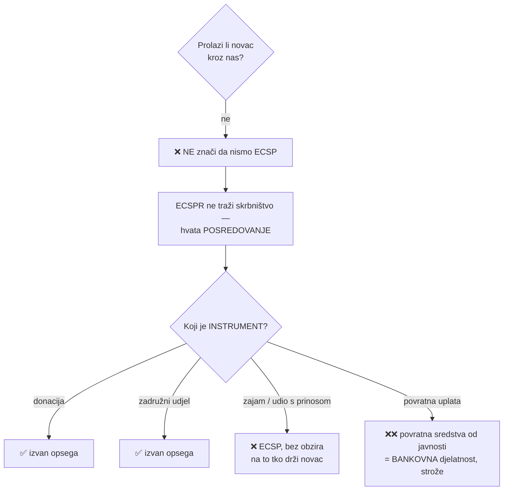

# 2026-09-15 — Istraživački dnevnik: što je provjereno, što nije, i gdje su bile slijepe ulice

Dokumenti 00–14 nose **zaključke**. Ovaj nosi **postupak**: koji su izvori stvarno
otvoreni, što se pokazalo mrtvim, i koja tvrdnja još nije provjerena. Cilj je da
sljedeći prolaz ne ponavlja isti posao i, važnije, da ne naslijedi tvrdnju misleći
da je provjerena.

**Vezani dokumenti:** [02-trziste-hrvatska](./02-trziste-hrvatska.md) ·
[13-konkurencija](./13-konkurencija.md) · [08-karta-i-geo](./08-karta-i-geo.md)

**Parnjak za kod:** [2026-09-15-dnevnik-izvedbe](./2026-09-15-dnevnik-izvedbe.md) —
isti postupak, ali za stack, zamke u izvedbi i ispravke invarijanti.

---

## 1. Slijepe ulice — ne ponavljaj

| Što | Što se dogodilo | Pouka |
|---|---|---|
| **`oie-aplikacije.mzoe.hr`** | HTTP 000, timeout. Zaključeno „možda ugašeno" i zapisano kao rizik. **Bilo je krivo** — domena je zastarjela, ispravna je **`oie-aplikacije.mingo.hr`** (korisnik dao ispravan link) | Ministarstvo je preimenovano MZOE → MINGO. **Prije nego zaključiš da vladin servis ne radi, provjeri je li domena aktualna.** Nedostupnost s jednog stroja nije dokaz gašenja |
| **Pretraga „Sun Exchange collapse"** | Rezultati zagađeni FTX-om — generički „crypto collapse" izrazi vuku na najveći slučaj | Za manje igrače koristi **navodnike oko imena** + specifične termine domene (`solar cell`, `business rescue`, `wind down`) |
| **Enerfip brojke s naslovnice** | Ukupni volumen i broj ulagatelja renderiraju se **klijentski** (brojači), pa scrape vrati prazno | Za SPA metrike idi na **treće recenzije** (Crowdscope, P2P Dash) ili arhivu, ne na naslovnicu |
| **Whois za `.hr` domene** | `whois prisoje.hr` vraća zapis **TLD registra** (`domain: HR`), ne domene — izgleda kao da je sve zauzeto | Za `.hr` koristi **DNS provjeru** (`dig NS/A`) kao prvi signal; whois ovdje ne radi posao |

---

## 2. Što je provjereno i drži

Svaka od ovih tvrdnji ima izvor u [02](./02-trziste-hrvatska.md) ili
[13](./13-konkurencija.md) i otvorena je izravno u ovoj sesiji.

- **ZEZ Sunce**: 127 članova, 140.000 € u ~10 dana, krov Gradske tržnice u
  Križevcima, energija za ~70 kućanstava, prinos „do 5 %" najavljen za 2026.,
  pristup preko Google obrasca. Izvor: `zez.coop/zez-sunce`, potvrda `green.hr`.
- **Ripple Energy**: stečajna uprava (Begbies Traynor), zadruge nastavljaju raditi;
  Graig Fatha 900+ članova, Kirk Hill 5.603 + 18 tvrtki, 4.688 MWh u siječnju;
  Trustpilot 2,6/5 (710 recenzija). Izvor: `thenews.coop`, potvrde
  `solarpowerportal.co.uk`, `windpowermonthly.com`.
- **Sun Exchange**: ~10.000 vlasnika ćelija; post-mortem izravno s
  `sunexchange.com` — pad potražnje od 2022., trošak administracije vlasnika,
  trust struktura onemogućila nadogradnju, greylisting ZA (velj. 2023.) + 45 %
  poreza po odbitku za strance.
- **Registar OIEKPP**: `oie-aplikacije.mingo.hr/pregledi/` nudi **JIZ-01** (pregled
  projekata) i **JIZ-02** (grafička analiza raspodjele). `/InteraktivnaKarta/` radi;
  bundle je **Angular + Azure Maps**, koji ispod koristi **maplibre**; transloco
  i18n; prekidači granica države i županija.
- **Energetske zajednice, pravni oblici**: EZG/ZOE su neprofitne pravne osobe, mogu
  biti udruga; energetske zadruge po Zakonu o zadrugama. Izvor:
  `energetske-zajednice.hr/legislation/hrvatsko-zakonodavstvo`.
- **GEF 2026**: 28.–29.10., Arena Zagreb, ulaz besplatan uz registraciju, 120+
  izlagača najavljeno, program pokriva i sustainable finance/ESG. Izvor: `zg-gef.com`.

---

## 3. ⚠️ Dug provjere — tvrdnje koje NISU potvrđene

**Ovo je najvažnije poglavlje dokumenta.** Ništa odavde ne smije u javni copy dok se
ne provjeri.

| # | Tvrdnja | Zašto je nesigurna | Kako provjeriti |
|---|---|---|---|
| **V1** | OIEKPP **ne pokriva** ~44.000 krovnih prosumera | Logično (OIEKPP prati projekte i povlaštene proizvođače, prosumeri idu preko HEP-ODS-a), ali **nije provjereno u podacima** | Otvoriti **JIZ-01** i pogledati broj i tip zapisa |
| **V2** | Ukupna neto proizvodnja RH 14.760 GWh (2024.) | jedini izvor je `tehnoeko.com.hr` — sekundaran | DZS ili HEP godišnje izvješće |
| **V3** | Cijena struje 0,176 €/kWh (2026.), +12,7 % | portal, ne HERA | HERA tarifni modeli |
| **V4** | FZOEU 600 €/kW, max 50 % | ovisi o **aktualnom natječaju** | FZOEU natječaji (blokada B11) |
| **V5** | Povrat ulaganja 5–7 god. | prodavači; drugi izvor kaže ~15 god. | **ne citirati kao tvrdnju** — samo izlaz kalkulatora |
| **V6** | Globalno tržište 415,8 M USD (2025.) | komercijalni izvještaj iza plaćanja | koristiti samo kao red veličine |
| **V7** | Kućanstva 35.345 / 275 MW | presjek stariji od ostalih brojki u istoj tablici | uskladiti na isti datum ili izbaciti |
| **V8** | bettervest, Ecco Nova, Lumo — opsezi | **nisu otvarani** ovaj krug | ako zatreba usporedba, otvoriti |

> **Pravilo:** brojka s oznakom ⚠️ u [02](./02-trziste-hrvatska.md) ili
> [13](./13-konkurencija.md) **ne ide u `lib/facts.ts`** dok se ne makne oznaka.

---

## 4. Odbačene alternative — i zašto

Da se ne predlažu ponovno.

| Odbačeno | Razlog |
|---|---|
| **Izmišljeno ime** (Prisoje, Suncostaj, Osunce, Zadruga.energy) | trošak objašnjavanja nove riječi koji u ovoj fazi nema tko platiti; `domovina.energy` se drži obitelji domena. `suncokret.hr` je uz to zauzet ([12](./12-ime-domena-okruzenja.md)) |
| **„Crowdfunding za solar" kao hero** | poziva pitanje o prinosu i licenci pred publikom koja zna; „tri zajednice u cijeloj zemlji" radi posao umjesto nas ([01](./01-vizija-i-pozicioniranje.md) §1.1) |
| **ECSP put** (zajam/udio uz prinos) | odobrenje HANFA-e, 3 mj. + KIIS, testovi znanja, kapitalni zahtjevi. Nije sprint nego odluka o poslovnom modelu ([03](./03-pravni-okvir.md) §6.1) |
| **Tokenizirani udio** | MiFID II vrijednosni papir; MiCA **isključuje** financijske instrumente pa ne pomaže. Ugovori `pinka-finance-mvp` neauditirani, V-1/V-2/V-3 otvoreni ([03](./03-pravni-okvir.md) §6.2) |
| **Monorepo shared-lib wiring** iz `pinka-finance/energy` (`@/*` → `../app/*`, `externalDir`) | bio je kompromis monorepoa; ovaj repo je izoliran namjerno ([10](./10-reuse-mapa.md) §1) |
| **Druga kartografska biblioteka** | cijela obitelj je na maplibre — i, kako se pokazalo, i službena državna karta ([08](./08-karta-i-geo.md) §5) |
| **`TokenSlider` / `YieldChip` / `KupovniModal`** iz `airkuna/tokenizacija` | korektni su tamo, **pravno pogrešni ovdje** — nose model D |
| **Provizija na prikupljena sredstva** | ruši i tvrdnju o 0 % i dio pravnog pozicioniranja; prihod je marža na izvedbi ([14](./14-poslovni-model.md) §3) |

---

## 5. Lanac zaključivanja koji je najlakše izgubiti

Dva mjesta gdje je logika suptilna i gdje bi je sljedeći prolaz mogao nesvjesno
pokvariti.

### 5.1 Non-custody ne štiti od ECSPR-a

**Posljedica:** ograničenje na modele A i B nije stilsko pravilo nego jedina stvar
koja Mod 2 drži izvan licence ([14](./14-poslovni-model.md) §2.4).

### 5.2 Zašto Mod 1 nije ECSP — dva neovisna razloga

Oba moraju ostati istinita; ako jedan padne, drugi još drži:

1. **Nema trećeg nositelja.** ECSPR uređuje posrednika koji spaja **treće**
   nositelje s ulagateljima. Nositelj smo mi → nema koga spajati.
2. **Nema instrumenta.** Uplata je **predujam na ugovor o djelu** — kupuju elektranu,
   ne ulažu. To nije financijski instrument uopće.

⚠️ Razlog 2 pada u trenutku kad se uplata opiše kao povratna ili prinosna. Zato lint
na zabranjene riječi ([E3](./03-pravni-okvir.md)) čuva pravnu poziciju, ne ton.

---

## 6. Što bi sljedeći istraživački krug trebao napasti

Poredano po vrijednosti, ne po lakoći.

1. **V1 — JIZ-01.** Određuje smije li registar uopće biti diferencijator. Najjeftinije,
   najveći učinak na pozicioniranje.
2. **Kontakt sa ZEZ-om** (B12). Nije istraživanje nego razgovor, ali odgovara na više
   pitanja nego ijedna pretraga: kako su riješili pravni oblik, koliko je stvarno
   trajalo i koštalo, što im je najviše smetalo u Google-obrazac procesu.
3. **Pravna pitanja** [03](./03-pravni-okvir.md) §9.8–§9.11 — escrow vs predujam,
   potrošački predujmi, registracija djelatnosti izvođenja.
4. **Status priključka po županijama.** Nitko to ne agregira
   ([02](./02-trziste-hrvatska.md) §6.4) — ako se dođe do podataka, to je sadržaj koji
   sam po sebi privlači promet na kartu.
5. **Licenca podataka OIEKPP-a** — upit ministarstvu; nema otvorenog izvoza, a seed
   registra bez toga stoji.
6. **Tri registrirane zajednice** — tko su, i bi li bile pilot.
