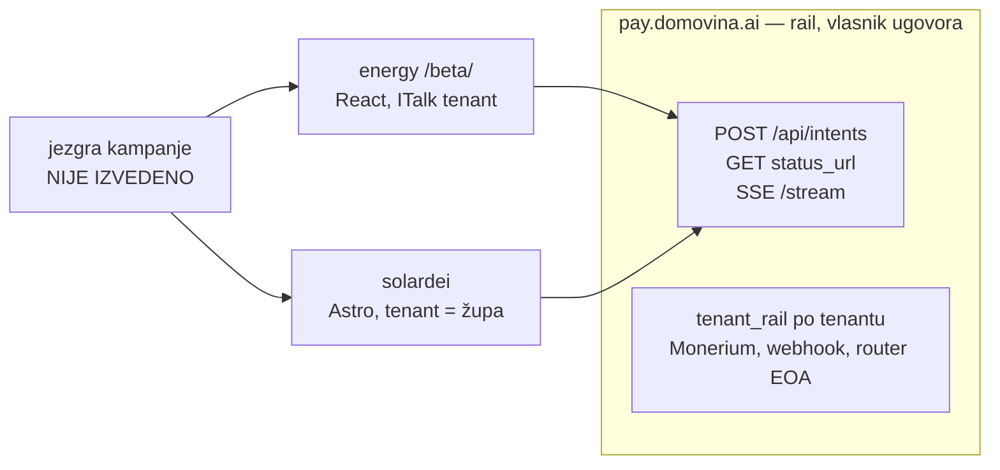

# solardei, rail za više tenanata i zajednička jezgra (5.10.2026.)

Analiza i odluke iz sesije 5.10.2026. Tri repoa:

- `~/git/domovinatv/energy.domovina.ai`: `/beta/`, tri vlastite elektrane, ITalk tenant
- `~/git/solardei/solardei-hr`: `/zajednicko-financiranje/` za župe, grana `iteracija-2`
- `~/git/domovinatv/pay.domovina.ai`: MPT rail, ADR 0017

Vezani dokumenti: [15](./15-pravi-projekti-vlastite-lokacije.md) §6–7,
[refactor/04](./refactor/04-beta-tok-novca.md), solardei `docs/07` i `docs/08`,
pay.domovina.ai `docs/decisions/0017-multi-tenant-rail.md`.

## 1. Glavni zaključak

Solardei **model B** (župa ima vlastiti Monerium KYB, IBAN i Safe, a softver je
naš) je **energy Mod 2**. Solardei je prvi Mod 2 klijent i dokazuje Mod 2 prije
samog energyja. Zato platformu gradimo kao **rail + zajedničku jezgru + N
frontenda**, a ne kao dva weba.

## 2. Što je solardei preuzeo i kako se razišlo

Solardei je energyjev `/beta/` **prepisao**, a nije ga uvezao kao biblioteku:
React prešao u čisti JS, a imena su prevedena na hrvatski
(`kampanje.ts`, `kampanje-klijent.ts`).

| Dio | energy | solardei |
|---|---|---|
| Ključ tenanta `pk_` | ne šalje ga (zadani ITalk) | obavezan, bez njega nema uplate |
| Pravilo ključeva u kodu (sukob interesa) | samo u docs | `moguUplate` s testovima, za modele A i B |
| Uloge potpisnika i razrada troška | nema | ima |
| Provjera Safea na lancu pri deployu | `scripts/check-beta.mts` | **nema**, treba prije prve prave kampanje |
| Zabranjene riječi | `forbidden-words.ts`, uz pravilo razlog i protuprimjer, lint nad cijelim copyjem | 11 regexa, provjerava samo stranice kampanja; dodatno ima `crowdfunding`, `investir`, `uloži` |

Isti ugovor s railom postoji u tri kopije: energy, solardei i checkout na railu.

## 3. Pravni nalaz: copy za model A

Solardei `TEKST.solardei.pravno` sadrži rečenicu „Ako elektrana ne bude
izgrađena, Solar Dei uplate **vraća** uplatiteljima". Lint je ne hvata, jer je
uzorak `\bvraćamo\b`.

Povrat predujma zbog neisporuke [14](./14-poslovni-model.md) §2.3 dopušta samo u
slučaju **1a**, gdje uplatitelj dobiva elektranu. U modelu A elektranu dobiva
župa, a račun ide župi. Uplatitelj zato nije stranka ugovora, pa model A
zapravo znači dar župi koji prolazi kroz izvođača. Ovo je pitanje za B1/D5, a
nalaz je još jedan razlog za model B.

Model A i energy Mod 1 imaju isti oblik (izvođač prima novac za elektranu), pa
odluka o D7/D9 vrijedi za oba.

## 4. Rail za više tenanata: izvedeno 5.10.2026.

Vidi ADR 0017. Ukratko:

- **Vjerodajnice i webhook po tenantu.** Tajne su šifrirane u D1
  (AES-GCM, KEK u secretu). Webhook ide na `/api/monerium/webhook/t/:id`.
- **Forward samo na whitelistu tenanta**, provjereno u tri sloja:
  `tenant_mismatch` u kodu, whitelista tenanta i Zodiac Roles na lancu.
- **SSE** `/api/intents/:sid/stream` preko Durable Objecta.
- **Admin onboarding** s koracima verify i activate.
- **Stanje:** `MULTI_TENANT_RAIL=0` (čeka prvu župu s KYB-om), `INTENT_SSE=1`.
  248/248 testova je prolazilo lokalno.
- **Smoke test na produkciji (5.10.):**
  - `/t/x` → 404
  - `/api/monerium/orders` → 401
  - nevaljan `Bearer` → 401 `invalid_tenant_key`
  - CORS propušta `solardei.hr`
  - SSE šalje snapshot i za origin `energy.domovina.ai`

## 5. energy na SSE-u (commit `f0344fa`)

`watchIntentStatus` u `lib/mpt-intent.ts` preslikava railov checkout:

- polling i stream kreću zajedno, a prvi SSE event gasi polling;
- greška streama vraća polling;
- završna faza zatvara `EventSource`; bez toga bi se ponovno spajao na isti
  završni snapshot;
- `onStatus` se zove samo kad se status promijeni (dio R4.2).

Panel nosi `data-transport`. Provjereno na živoj `/beta/`: `sse`, a u 8 s jedan
`GET` statusa umjesto četiri.

**Nije provjereno s pravim novcem:** prijelaz na „zaprimljeno" i „na Safeu"
preko SSE-a. To pokrivaju testovi (`lib/__tests__/mpt-intent.test.ts`) i
railov lokalni E2E.

## 6. Monerium

Na mailove od 28.9. i 2.10. nema odgovora, osim automatske potvrde od 22.9.
Follow-up je poslan 5.10. u istoj niti (partners@, cc support@ i
hello@italk.hr). Sadrži:

- link na `/beta/`;
- SSE;
- model sa župama i Zodiac Roles;
- pitanja a–e iz ADR 0017 (private app ili OAuth, offline pristup, opseg
  webhooka, ToS za premještanje unutar istog tenanta, `mpt:` mint na profilu
  tenanta) i ponovljeno pitanje 3 (pamti li se screening po profilu);
- poziv da pošalju EURe izravno na jedan od tri Safea;
- plan za Gnosis nodeove na iste tri lokacije.

**Prvi tenant se ne pali dok ne odgovore na a) i d).**

## 7. Otvoreno, po redu

1. **Odgovor Moneriuma (a–e).** Blokira `MULTI_TENANT_RAIL=1`.
2. **solardei `kampanje-klijent.ts`:**
   - mapirati `tenant_rail_disabled` i `tenant_rail_not_configured` na `tenant`;
   - prijeći na SSE kao energy, s `es.close()` na završnoj fazi;
   - prenijeti tekst uvjeta za župu iz ADR 0017 §Admin na stranicu kampanje i u
     `docs/08`.
3. **solardei:** prenijeti `check-beta.mts` (Safe na lancu pri deployu).
4. **Zajednička jezgra** (paket uz rail):
   - tipovi i pravilo ključeva;
   - klijent za intent i SSE, čitanje lanca, zaprimljene uplate;
   - EPC pravila;
   - zabranjene riječi s razlogom i protuprimjerom, plus `vrać\w*` s
     odobrenim negacijama;
   - provjera Safea.

   Spojiti s refactor valom R4 (R4.1, R4.5), da se kod ne refaktorira dvaput.
5. **energy:**
   - `PendingWatcher` i dalje čita status svakih 15 s, a lanac se čita s
     gnosisscana svakih 20 s;
   - sljedeći korak je node listener ([15](./15-pravi-projekti-vlastite-lokacije.md)
     §6, korak 2), koji ovisi o pokretanju Gnosis nodea.
6. **Pravo:** D7 (model A ili B), D8 (KYB župe, suglasnost biskupije) i B1/D5.
   Jedno pravno mišljenje može pokriti i energy 1a/1c i solardei A/B.
7. **Rail:** `nonceManager` (ostatak Fable P0-5). ITalk dijeli jedan router EOA.
